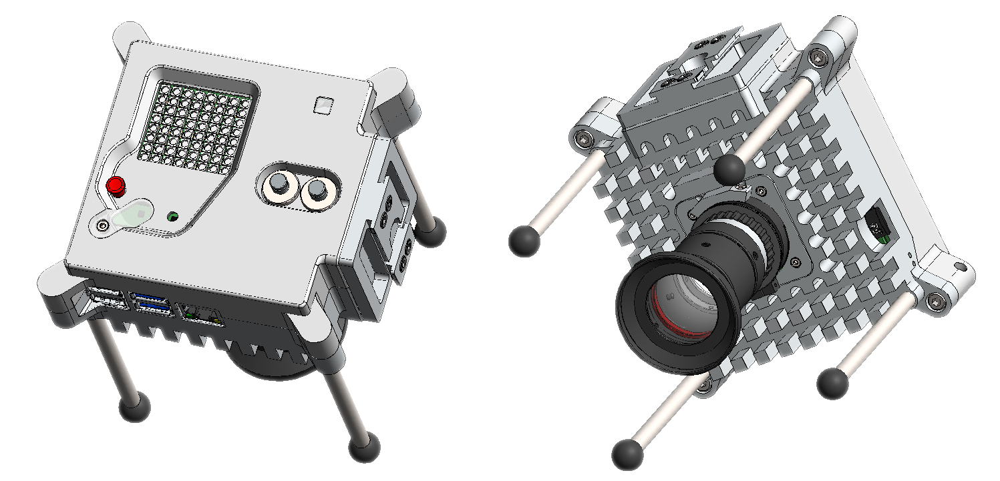

## Introduction

In this project, you will learn how to turn your Phase 1 experiment idea into a real experiment that can run on your own Astro Pi hardware and on the International Space Station (ISS)!

Don't know about Mission Space Lab? Don't panic! Head over to the [Astro Pi website](https://astro-pi.org/mission-space-lab/) for more information and to sign up for next year!

### What you will make

You will build your very own Astro Pi and write a Python program to gather data to support or reject your experiment hypotheses. You will learn how to test your program to give it the best chance of running successfully aboard the International Space Station (ISS)!

### What you will learn

By reading this guide you will learn:
* how to build an Astro Pi and how to use it
* how to plan your experiment
* how to write a Python program using the libraries available aboard the ISS, including
  * how to save data captured from the sensors and the camera
  * how to run your program for 3 hours
  * how to find the location of the ISS
  * how to improve your program with error handling and logging
* You will also learn about how to test and review your work to give your team the best chance of running your experiment on the ISS.

## Guidelines & Pre-Submission Checklist

In order to have your program run aboard the ISS it's really important that you read the [guidelines on the Astro Pi website](https://astro-pi.org/mission-space-lab/guidelines) and that you look over the [Phase 2 program checklist](https://astro-pi.org/mission-space-lab/guidelines/program-checklist) before submitting your work. Bear in mind that there are some differences in what you are allowed to do depending on if your experiment theme is "Life On Earth" or a "Life In Space".

