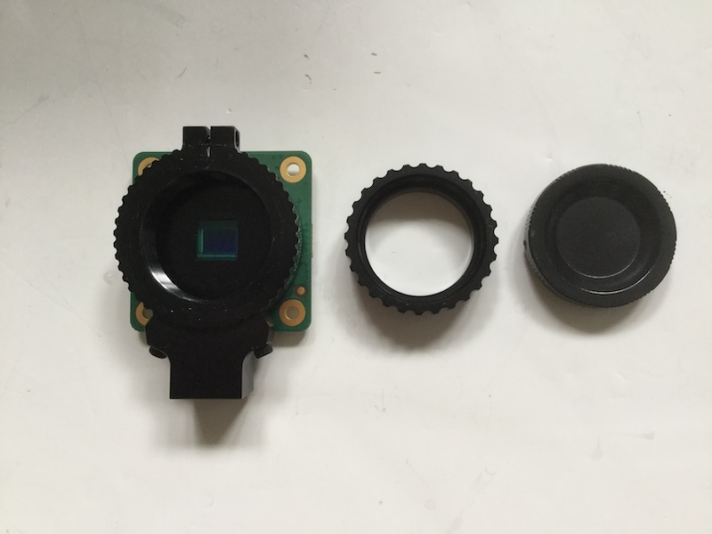
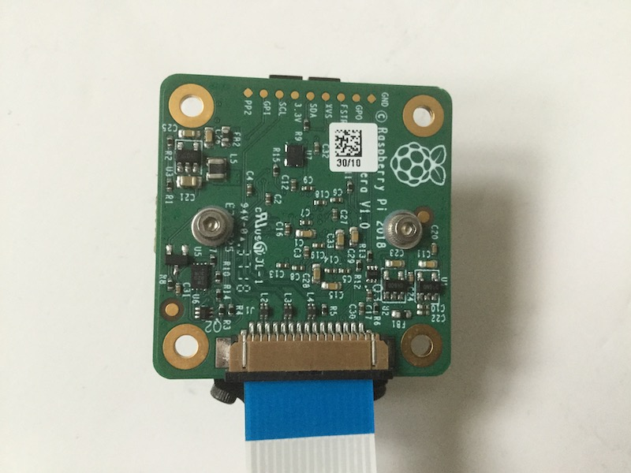
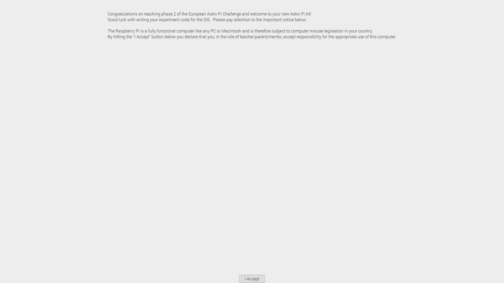
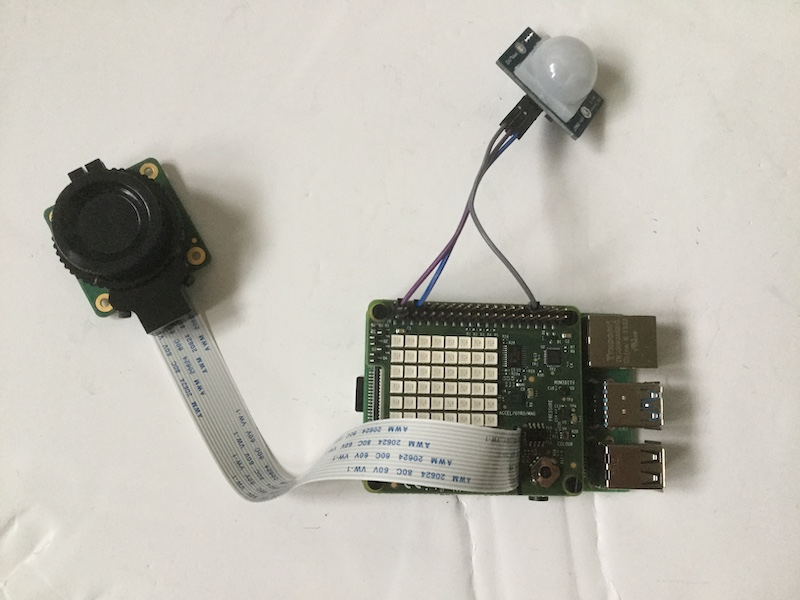
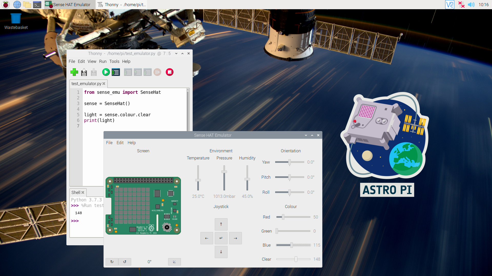
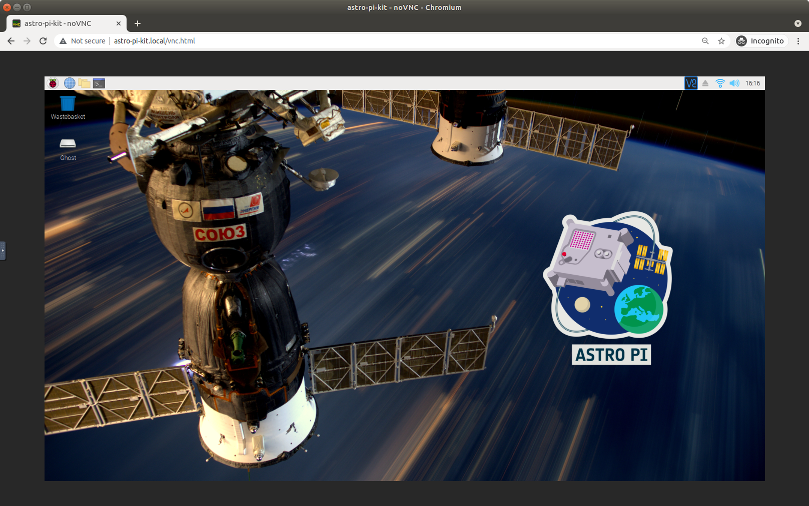

## Getting started

If you have received an official Astro Pi kit from ESA, you have everything you need to develop and test your Phase 2 program for Mission Space Lab (MSL). If you want to, you could even [create your own Astro Pi flight case](https://projects.raspberrypi.org/en/projects/astro-pi-flight-case-mk2), but don't worry, that's not essential, and completion of Mission Space Lab **does not** rely on having the flight case.

### Assembling the hardware

--- task ---
Unpack everything from your kit.

--- /task ---

--- task ---
Take the black hexagonal spacer columns from the small bag that comes with the Sense HAT. Use the accompanying screws to connect them to the bottom of the Raspberry Pi 4.


--- /task ---

--- task ---
Insert the camera cable into the CSI (Camera Serial Interface) socket on the Raspberry pi.  

[[[rpi-picamera-connect-camera]]]


--- /task ---

--- task ---
Take the Sense HAT and remove the short header if it is attached.


--- /task ---

--- task ---
Line up the tall header with the corresponding holes on the Sense HAT.  


--- /task ---

--- task ---
Push the header all the way through. Make sure none of the pins are obstructed and that they are lined up correctly so that they do not become bent.  


--- /task ---

--- task ---
Feed the camera cable through the slot on the Sense HAT and then sit the Sense HAT onto the Raspberry Pi device. Make sure that all 40 GPIO pins line up with the corresponding holes in the tall header.   

<iframe width="560" height="315" src="https://www.youtube.com/embed/VzYGDq0D1mw" frameborder="0" allow="accelerometer; autoplay; encrypted-media; gyroscope; picture-in-picture" allowfullscreen></iframe>


--- /task ---

--- task ---
Use the four remaining black screws to secure the Sense HAT stack to the spacers. 


--- /task ---

--- task ---
Now take the PIR and remove the foam pin protector block. 


--- /task ---

--- task ---
Connect three wires to the pins on the PIR. Note the labels on the back of the PIR circut board which indicate the use of each pin: 

- The GND needs to be connected to corresponding ground pin on the Raspberry Pi
- The VCC needs to be connected to a 3V3 pin on the Raspberry Pi
- The OUT should be connected to [GPIO pin 12](https://projects.raspberrypi.org/en/projects/physical-computing/1) on the Raspberry Pi


--- /task ---

--- task ---
Connect the wires from the PIR to the appropriate GPIO pins on the Raspberry Pi. You can use [the diagrams here](https://www.raspberrypi.org/documentation/usage/gpio/) to help you make sure that you connect the wires to the correct pins. 


--- /task ---


#### Converting a camera for IR-sensitive Life on Earth experiments

The high-quality camera sensor can detect infrared (IR) light. However, the sensor housing contains an IR filter, which is used to greatly reduce the camera’s sensitivity to IR light.  This is so that the images captured by the high-quality camera sensor look the same as what we see with our eyes (which are not sensitive to IR light). 

If your Life on Earth experiment requires an IR-sensitive camera (like the one on Astro Pi IR), then you will need to convert the high-quality camera sensor you received in your kit by removing the IR filter. If you are programming a Life in Space experiment, or your Life on Earth experiment requires photos to be taken in the visible light spectrum only, then you should not convert your high-quality camera sensor. Please skip to the final assembly steps below. 


--- collapse ---
---
title: Converting a camera for IR-sensitive experiments
---

**Note**: This process cannot be reversed or undone once completed.

--- task ---

Please ensure that you need the IR-sensitive camera before following the [instructions here](https://www.raspberrypi.org/documentation/accessories/camera.html#raspberry-pi-hq-camera-filter-removal).
--- /task ---

Now you can add the DB660/850-25.4 red/NIR dual band pass filter. This been designed primarily for NDVI (Normalized Difference Vegetation Index) imaging applications. By adding it to the High Quality Camera sensor, only reflected red light (660nm) and reflected near-infrared light (850nm) will be captured by the sensor.  See our [NDVI project](https://projects.raspberrypi.org/en/projects/astropi-ndvi) for more information. 

--- task ---
 
Make sure the back focus ring is screwed all the way in. 


--- /task ---

--- task ---
 
Unscrew the high-quality camera sensor lens cap and the C/CS adapter. 


--- /task ---

--- task ---
 
Take the filter and sit it onto the hole in the centre of the high-quality camera sensor. 


--- /task ---

--- task ---
 
Gently start turning the filter clockwise using just your fingers, so that the filter screws down into the high-quality camera sensor. Take care not to touch the glass part of the lens and leave greasy fingerprints!


--- /task ---

--- task ---
 
Take the tool provided with the filter and line up the two knobbly bits at each end with the corresponding dimples in the filter. If you have a 3D printer, you might like to print a handle for the tool to make it easier to grip. One of these handles has been printed and sent to the ISS for the astronauts to use when completing the task — but it isn't required. 


--- /task ---

--- task ---
 
Continue gently turning the filter using the tool. Take care not to touch the glass part of the lens with the tool — it will scratch it!


--- /task ---

--- task ---
 
You should start to feel increasing resistance as the filter gets lower. After about nine full turns, the filter should be as low as it can go and you won't be able to turn it any further. Be careful not to over-tighten. 


--- /task ---
--- /collapse ---

#### Final assembly steps 

--- task ---
Insert the other end of the camera cable into the CSI socket on the high-quality camera sensor. 


--- /task ---

--- task ---
Remove the cap from the high-quality camera sensor. 


--- /task ---

--- task ---
Remove the C/CS adapter ring from the high-quality camera sensor. 


--- /task ---

--- task ---
Remove the caps from the end of the 6mm lens and screw the lens onto the high-quality camera sensor. 


--- /task ---

**Note**: The camera sensor in the ESA kit is the same high-quality camera as the one found in the new Astro Pis on the ISS. You can read the [documentation about the HQ camera](https://www.raspberrypi.org/documentation/hardware/camera/), and a lot of detailed technical information can also be found in [the relevant section of the PiCamera library documentation](https://picamera.readthedocs.io/en/latest/fov.html#camera-hardware).

Your Astro Pi kit should now be complete. Insert your SD card, connect to a monitor, keyboard, and mouse and finally plug in the USB-C power lead. When you power up your Astro Pi, you will be invited to accept the ESA Licence Agreement as shown in the image below. 



Once you have accepted the licence agreement, you will be asked to create a new username and password, to set the system time and language settings, and to connect to a WiFi network. For more details on setting up your Raspberry Pi, take a look at [this guide](https://projects.raspberrypi.org/en/projects/raspberry-pi-getting-started/4).




#### Performance

The ESA kits for Astro Pi 2022/23 contain Raspberry Pi 4 devices with 4GB of memory (RAM). They are almost identical to the new Astro Pis on the ISS, except that those have 8GB of memory. This means there should be very little difference in performance between the computer on which you develop and test your code and the computer where it actually runs, unless your experiment requires a lot of memory.


### Software and your development environment

After assembling your hardware, you will need to set up your development environment. If you received a kit from ESA, it will contain an SD card with the Desktop version of the Flight OS: a custom-built version of the Raspberry Pi Operating System that you will need.



You will use this environment to **develop** and **test** the code for your experiment. Making sure that your program runs successfully in this environment is the best way to ensure that your experiment passes our testing procedure and can run on the Astro Pis on the ISS without any modifications.

Please, **do not perform any upgrades or install any additional packages or Python libraries** in this environment as these will not be available when your experiment runs.

--- collapse ---
---
title: Accessing the Desktop Flight OS remotely
---

The Desktop Flight OS can be configured so that you are able to connect to it
from another desktop. To do this, you will need to 1. install a [compatible VNC client](https://www.realvnc.com/en/connect/download/viewer/) on the other desktop and 2. enable
VNC on the Astro Pi itself by entering the commands below.

The default password to connect via VNC is `raspberry` but you are *highly encouraged* to change this using `vncpasswd -service` before enabling VNC.

```bash
sudo raspi-config nonint do_vnc 0 && \
  systemctl enable novnc && \
  systemctl start novnc && \
  systemctl unmask avahi-daemon && \
  systemctl enable avahi-daemon && \
  systemctl start avahi-daemon
```

You can also connect to the Desktop Flight OS using just a browser, albeit less-securely. On a machine that is connected to the same network as your Astro Pi kit, open up a browser and type `https://astro-pi-kit.local/vnc.html` in the address bar. 
You will have to tell your browser to trust your unique Astro Pi SSL certificate to continue (e.g. on Chrome, type `thisisunsafe` while the browser tab has focus), but once you have done so you will be lead to the noVNC connection page. Click on the `Connect` button, enter the password you set in `vncpasswd`, and you should see the Flight OS desktop in your browser!



--- /collapse ---


--- collapse ---
---
title: Downloading Operating System images (optional)
---

If you want to create additional SD cards to use for Astro Pi, you can download the [Desktop Flight OS image file](https://downloads.raspberrypi.org/AstroPi_latest) used in the ESA kits. After downloading, you can use any software tool to write the image file to your own SD card. See [this guide](https://www.raspberrypi.org/documentation/installation/installing-images/) for instructions on how to do this.

--- /collapse ---

--- collapse ---
---
title: Sample data
---

The Desktop version of the Flight OS also contains a `Data` folder with sample data from a previous mission, which can be used to help test and refine your code. You can also download this [sample data](https://rpf.io/ap-sample-data) separately.

#### Sensor readings

There is a comma-separated values (CSV) file with 24 hours worth of data from all of the Sense HAT sensors. The columns in this file are in the order of this table:

| Header | Description |
| ---    | --- |
| Date/Time | the date and time the measurements were taken. |
| Latitude | an angle partly describing where over the Earth the measurements were taken. |
| Longitude | an angle partly describing where over the Earth the measurements were taken. |
| Temperature | the current temperature in degrees Celsius from the humidity sensor. |
| Humidity | the percentage of relative humidity from the humidity sensor. |
| Pressure | the pressure in Millibars from the pressure sensor. |
| Compass | the angle North from the magnetometer in degrees. |
| MagX | the raw x axis magnetometer data in microteslas (µT). |
| MagY | the raw y axis magnetometer data in microteslas (µT). |
| MagZ | the raw z axis magnetometer data in microteslas (µT). | 
| Pitch | a component of the current orientation from the gyroscope in radians. |
| Roll | a component of the current orientation from the gyroscope in radians. |
| Yaw | a component of the current orientation from the gyroscope in radians. |
| AccelX | the raw x axis accelerometer data in Gs. |
| AccelY | the raw y axis accelerometer data in Gs. |
| AccelZ | the raw z axis accelerometer data in Gs. | 
| R | the amount of incident red light, scaled to 0-256. | 
| G | the amount of incident green light, scaled to 0-256. | 
| B | the amount of incident blue light, scaled to 0-256. | 
| C |  the amount of incident clear light, scaled to 0-256. | 
| Motion | a boolean signalling whether motion was detected by the PIR sensor. | 

LibreOffice Calc is a spreadsheet program similar to Microsoft Excel and is installed on the Desktop Flight OS. You can use this to look at the data and plot charts.

#### Images

There is also a sample of photos taken by the Mark II Astro Pi IR and Vis cameras in the `Data` folder.

You could use these images to train a machine learning algorithm to recognise different types of views, for example. However, please note that there is no guarantee that the location, view, and orientation of the Astro Pi will be exactly the same when your program runs on the ISS. Therefore, your program should be flexible enough to adapt to any changes.

--- /collapse ---
