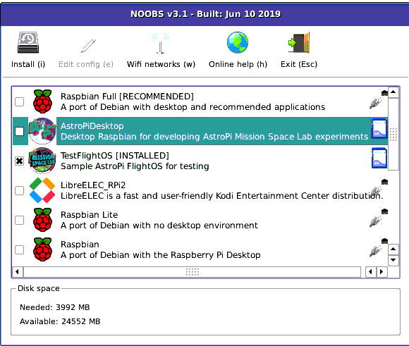
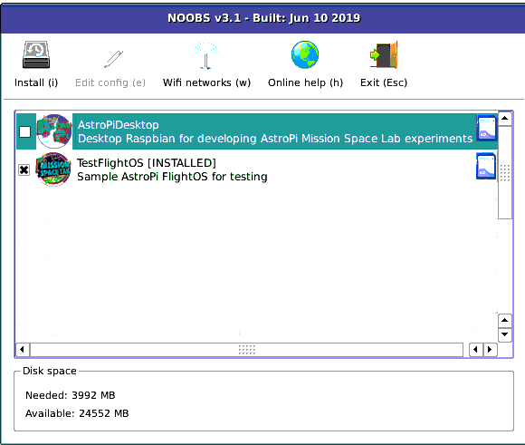
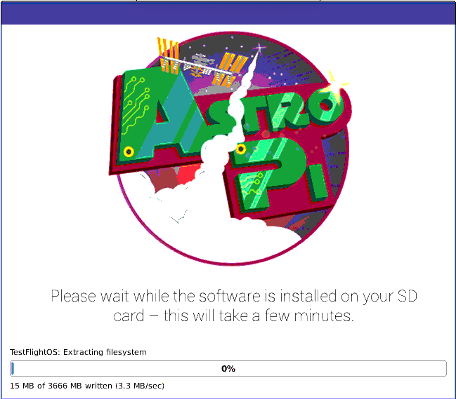
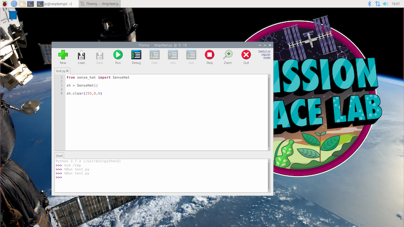
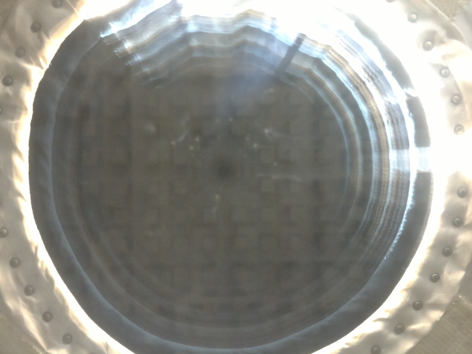
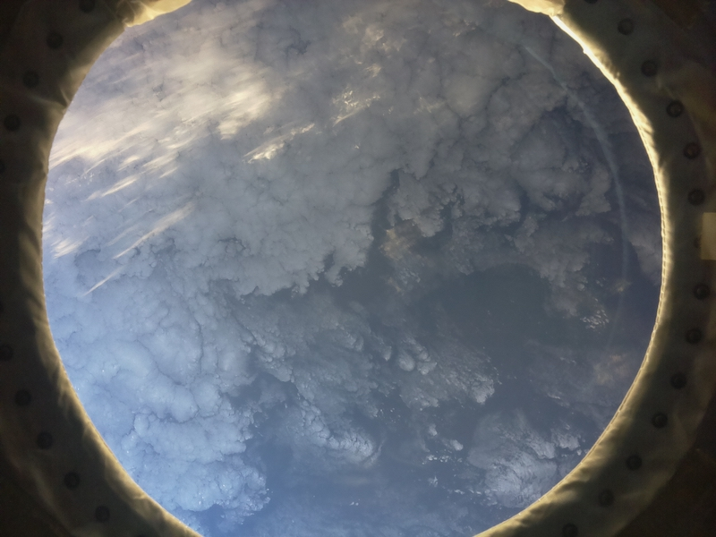
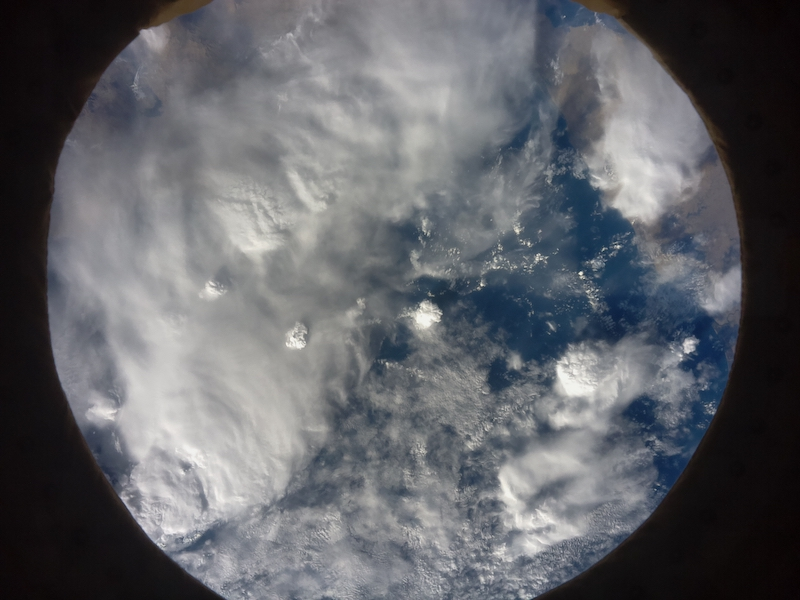

## Getting started

If you have received an official Astro Pi kit from ESA, you have everything you need to develop and test your Phase 2 program for Mission Space Lab (MSL). If you want to, you could even [create your own Astro Pi flight case](https://projects.raspberrypi.org/en/projects/astro-pi-flight-case), but don't worry, that's not essential, and completion of Mission Space Lab **does not** rely on having the flight case.

The first thing you'll need to do is set up your development environment. If you received a kit from ESA, it will contain a Raspberry Pi with two identical SD cards from which you can install the different versions of Raspbian — the Raspberry Pi operating system — that you will need.

### SD card images

The Astro Pis on the ISS run a modified version of the normal Raspbian operating system software. This is known as the Flight OS and you'll need to make sure that the program that you create will run on it without any modifications.

The two SD cards both contain our operating system installer, [NOOBS](https://www.raspberrypi.org/documentation/installation/noobs.md). Put one of the SD cards into the Raspberry Pi, [connect everything up](https://projects.raspberrypi.org/en/projects/raspberry-pi-setting-up/4), and start it booting. After a few seconds, you should see the NOOBS selection screen, showing the different operating systems that are available.  If you have connected your Raspberry Pi to a network using the Ethernet port, then you may see several options.



If your Raspberry Pi is offline, then you'll just see two options.



Whichever view you have, select 'AstroPiDesktop' and click the **Install** button.



This process will take a few minutes, and your Raspberry Pi will reboot into the Desktop operating system once it has finished. You should use this SD card for editing and developing your program.



#### The Desktop image

The Desktop operating system also contains a folder with sample data from the 2018–19 mission which can be used to help test and refine your code. There is a comma-separated variable (CSV) file with 3 hours worth of data from all of the Sense HAT sensors. The columns in this file are in this order:

Date
Time
Humidity
Temperature
Pressure
Pitch (as measured by gyroscope)
Roll (as measured by gyroscope)
Yaw (as measured by gyroscope)
Pitch (as measured by accelerometer)
Roll (as measured by accelerometer)
Yaw (as measured by accelerometer)
Raw accelerometer X value
Raw accelerometer Y value
Raw accelerometer Z value
Raw magnetometer X value
Raw magnetometer Y value
Raw magnetometer Z value
Latitude degrees
Latitude minutes
Latitude seconds
Longitude degrees
Longitude minutes
Longitude seconds

LibreOffice Calc is a spreadsheet program similar to Microsft Excel and is installed on the Desktop operating system. You can use this to look at the data and plot charts.

There is also a sequence of photos taken by the IR camera. The sequence starts at 'night', and so the first few photos are black.


Then, the window gradually appears as light starts to flood in.



By image 150, the Earth below becomes visible.



And eventually, the area surrounding the window cannot be seen at all.



You could use these images to train a machine learning algorithm to recognise different types of views. However, please note that there is no guarantee that the location, view, and orientation of Astro Pi Izzy will be exactly the same in 2020. Therefore, your program should be flexible enough to adapt to any changes.

#### The sample Flight OS

Now take the second SD card and repeat the installation process, but this time, select the 'Sample Flight OS' option. You should use this SD card for testing your program.

The packages installed on both the Desktop and Sample Flight OS match those available on the Astro Pi computers on the ISS. You should not perform any upgrades or install any additional packages or Python libraries as these will not be available when your experiment runs.

### Using the hardware

You may wish to revisit [the videos from Phase 1](https://www.esa.int/Education/AstroPI/European_Astro_Pi_Challenge_2019-20_now_open) to remind yourself of the limitations of the Astro Pi hardware aboard the ISS. We also have the following resources to help you get started with the Sense HAT and Camera Module:

[[[rpi-sensehat-attach]]]

If you've never used the Sense HAT before, [start with this short project](https://projects.raspberrypi.org/en/projects/getting-started-with-the-sense-hat/), and come back here once you're aware of basic Sense HAT uses.


[[[rpi-picamera-connect-camera]]]

Note that, because you will be using the Raspberry Pi Camera Module with the Sense HAT, you'll need to thread the camera's ribbon cable through the slot on the Sense HAT before connecting it the Raspberry Pi.

<iframe width="560" height="315" src="https://www.youtube.com/embed/VzYGDq0D1mw" frameborder="0" allow="accelerometer; autoplay; encrypted-media; gyroscope; picture-in-picture" allowfullscreen></iframe>

If you've never used the Camera Module before, [start with this beginners' project](https://projects.raspberrypi.org/en/projects/getting-started-with-picamera/), and come back here once you've tried using the basic `picamera` Python library functions.

Please note that the cameras on the Astro Pis on the ISS are the V1 Camera Module that was available in 2014. The later V2 Camera Module that you can buy now (and that are included in the ESA kits) has an upgraded sensor that is capable of producing images at resolutions not available on the V1 model. Therefore, you should make sure that the resolution that you specify in your code is available on the V1 Camera Module. You can find more detailed information in [this section of the PiCamera library documentation](https://picamera.readthedocs.io/en/release-1.13/fov.html?highlight=v2#sensor-modes), but examples of typical resolutions that you might wish to use with the V1 Camera Module are:

 2592×1944, 1920×1080, 1296×972, 1296×730, and 640×480

## Performance

The Raspberry Pis in the ESA kits for Astro Pi 2018/19 are Raspberry Pi 3s. However, the Astro Pis currently on the ISS are the older Raspberry Pi model B+. A Raspberry Pi 3 is a new model, and therefore faster and more powerful than a B+. You should bear this in mind when writing the code for your experiment: some tasks that need a lot of computing power (e.g. they involve complicated mathematics or the processing of lots of data) will run more slowly on the Astro Pis on the ISS than on the Raspberry Pi in your ESA kit. In particular, using Python libraries like `OpenCV` (to process images captured with the Camera Module), or `ephem` (to work out which city the ISS is passing over) will be significantly slower on the Astro Pis.  

See the 'Test your code' section for instructions for creating a test SD card image that is more representative of the performance of the Astro Pis on the ISS.

## Write your program

Now you can start writing the program for your experiment. To do this, you'll need to plan your coding sessions, understand the best way to write the program for your experiment, and ensure that it will work on the Astro Pis on the ISS. To help with planning, we've put together a teachers' and mentors' guide for Phase 2 that provides useful tips for facilitating your team's coding of their experiment.

### Which version of Python should you use?

Programs for all MSL challenge entries must be written in **Python 3**.

If you find a Python library that you need for your experiment and that is Python 2 only, please contact us — we will help you find an alternative approach.

### Python libraries

We've installed a collection of Python libraries on the Astro Pi's Flight OS. Here's some information on how to install them and what you can use them for.

Remember that you can download the Flight OS or run our one-line installer to get all of these libraries on your Raspbian SD card. If you are using another version of Raspbian or have not run the one-line installer, you can follow the installation instructions in the information boxes below to make sure that you get the same versions of the libraries as the ones installed on the ISS.

--- collapse ---
---
title: pyephem
---

#### Usage

You can download the telemetry data for the ISS flight path to use the `pyephem` library in your tests. When your code runs, it will tell you exactly where the ISS currently is.

Browse to, or download and open, [celestrak.com/NORAD/elements/stations.txt](https://www.celestrak.com/NORAD/elements/stations.txt) and copy and paste the first three lines as variables into your code to get the latest telemetry data for the ISS flight path. This data will be automatically updated when your code runs on the ISS.

```python
from ephem import readtle

name = "ISS (ZARYA)"
line1 = "1 25544U 98067A   18356.58700427  .00000680  00000-0  17564-4 0  9997"
line2 = "2 25544  51.6379 159.8223 0004659 171.1463 304.0053 15.54085692147811"

iss = readtle(name, line1, line2)
iss.compute()
print(iss.sublat, iss.sublong)
```

#### Documentation

- [rhodesmill.org/pyephem/quick.html](https://rhodesmill.org/pyephem/quick.html)

--- /collapse ---

--- collapse ---
---
title: picamera
---

`picamera` is the Python library for controlling the Raspberry Pi Camera Module. It is compatible with V1 and V2 Camera Modules. The Astro Pi unit has the V1 Camera Module on board, but you can test with either version as long as you don't exceed the V1's maximum resolution of 2592×1944.

#### Usage

```python
from picamera import PiCamera
from time import sleep

camera = PiCamera()
camera.resolution = (2592, 1944)  # max resolution

for i in range(3*60):
    camera.capture('image{:3d}'.format())  # take a picture every minute for 3 hours
    sleep(60)
```

#### Documentation

- [picamera.readthedocs.io](https://picamera.readthedocs.io/en/release-1.13/)

--- /collapse ---

--- collapse ---
---
title: colorzero
---

colorzero is a colour manipulation library that aims to be simple to use and Pythonic in nature.

#### Usage

colorzero makes it easy to transition between two colours:

```python
from colorzero import Color
from sense_hat import SenseHat

sense = SenseHat()

start = Color('magenta')
end = Color('cyan')

# slowly and naturally transition the Sense HAT from magenta to cyan
for color in start.gradient(end, steps=100):
    sense.clear(color.rgb_bytes)
    sleep(0.1)
```

#### Documentation

- [colorzero.readthedocs.io](https://colorzero.readthedocs.io/en/release-1.1/)

--- /collapse ---

--- collapse ---
---
title: gpiozero
---

GPIO Zero is a simple but powerful GPIO library. While much of its functionality is prohibited (no access to GPIO pins), some of it can be handy in your experiment, such as the internal device `CPUTemperature`.

#### Usage

Compare the Raspberry Pi's CPU temperature to the Sense HAT's temperature reading:

```python
from sense_hat import SenseHat
from gpiozero import CPUTemperature

sense = SenseHat()
cpu = CPUTemperature()

while True:
    print('CPU: {}'.format(cpu.temperature))
    print('Sense HAT: {}'.format(sense.temperature))
```

#### Documentation

- [gpiozero.readthedocs.io](https://gpiozero.readthedocs.io/en/v1.4.1/)

--- /collapse ---

--- collapse ---
---
title: GDAL
---

The Geospatial Data Abstraction Library is an open-source, cross-platform set of libraries and low-level tools for working with geospatial data in many formats.

#### Documentation

- [pypi.org/project/GDAL](https://pypi.org/project/GDAL/)

--- /collapse ---

--- collapse ---
---
title: numpy
---

`numpy` is a general-purpose array-processing package designed to efficiently manipulate large multidimensional arrays of arbitrary records without sacrificing too much speed for small multidimensional arrays.

#### Usage

`numpy` is particularly handy for capturing camera data for manipulation:

```python
from picamera import PiCamera
from time import sleep
import numpy as np

camera = PiCamera()

camera.resolution = (320, 240)
camera.framerate = 24
output = np.empty((240, 320, 3), dtype=np.uint8)
sleep(2)
camera.capture(output, 'rgb')
```

#### Documentation

- [docs.scipy.org/doc/numpy](https://docs.scipy.org/doc/numpy/user/index.html)

--- /collapse ---

--- collapse ---
---
title: SciPy
---

SciPy is a free and open-source Python library used for scientific computing and technical computing. SciPy contains modules for optimisation, linear algebra, integration, interpolation, special functions, FFT, signal and image processing, ODE solvers, and other tasks common in science and engineering.

#### Documentation

- [docs.scipy.org/doc/scipy](https://docs.scipy.org/doc/scipy/reference/)

--- /collapse ---

--- collapse ---
---
title: tensorflow
---

TensorFlow is Google's machine learning framework.

#### Documentation

- [tensorflow.org](https://www.tensorflow.org/)

--- /collapse ---

--- collapse ---
---
title: pandas
---

pandas is an open-source library providing high-performance, easy-to-use data structures and data analysis tools.

#### Documentation

- [pandas.pydata.org](https://pandas.pydata.org/)

--- /collapse ---

--- collapse ---
---
title: logzero
---

logzero makes Python logging easier.

#### Usage

```python
from logzero import logger

logger.debug("hello")
logger.info("info")
logger.warning("warning")
logger.error("error")
```

#### Documentation

- [logzero.readthedocs.io](https://logzero.readthedocs.io/en/latest/)

--- /collapse ---

--- collapse ---
---
title: keras
---

Keras is a high-level neural networks API, and is capable of running on top of TensorFlow.

#### Documentation

- [keras.io](https://keras.io/)

--- /collapse ---

--- collapse ---
---
title: matplotlib
---

matplotlib is a 2D plotting library that produces publication-quality figures in a variety of hard copy formats and interactive environments.

#### Usage

```python
from sense_hat import SenseHat
from gpiozero import CPUTemperature
import matplotlib.pyplot as plt
from time import sleep

sense = SenseHat()
cpu = CPUTemperature()

st = []
ct = []

for i in range(100):
    st.append(sense.temperature)
    ct.append(cpu.temperature)
    sleep(1)

plt.plot(st)
plt.plot(ct)
plt.legend(['Sense HAT temperature sensor', 'Raspberry Pi CPU temperature'], loc='upper left')
plt.show()
```


#### Documentation

- [matplotlib.org](https://matplotlib.org/)

--- /collapse ---

--- collapse ---
---
title: pisense
---

`pisense` is an alternative interface to the Raspberry Pi Sense HAT. The major difference to `sense_hat` is that in `pisense` the various components of the Sense HAT (the screen, the joystick, the environment sensors, etc.) are each represented by separate classes that can be used individually or by the main class that comprises them all.

The screen has a few more tricks including support for any fonts that PIL supports, representation as a numpy array (which makes scrolling by assigning slices of a larger image very simple), and several rudimentary animation functions. The joystick, and all sensors, have an iterable interface too.

#### Usage

```python
from pisense import SenseHAT, array
from colorzero import Color

hat = SenseHAT(emulate=True)
hat.screen.clear()

B = Color('black')
r = Color('red')
w = Color('white')
b = Color('blue')

black_line = [B, B, B, B, B, B, B, B]
flag_line = [B, b, b, w, w, r, r, B]
flag = array(black_line * 2 + flag_line * 4 + black_line * 2)

hat.screen.fade_to(flag)
```

#### Documentation

- [pisense.readthedocs.io](https://pisense.readthedocs.io/en/latest/)

--- /collapse ---

--- collapse ---
---
title: opencv
---

`opencv` is an open-source computer vision library. The Astro Pi units specifically have the `opencv-contrib-python-headless` package installed, which includes all of `opencv` plus additional modules (listed in the [opencv docs](https://docs.opencv.org/master/)), and excludes all GUI functionality.

#### Documentation

- [docs.opencv.org](https://docs.opencv.org/3.4.3/)

--- /collapse ---

--- collapse ---
---
title: scikit-learn
---

`scikit-learn` is a set of simple and efficient tools for data mining and data analysis that are accessible to everybody, and reusable in various contexts. It's designed to interoperate with `numpy`, `scipy`, and `matplotlib`.

#### Documentation

- [scikit-learn.org](scikit-learn.org/stable/documentation.html)

--- /collapse ---

--- collapse ---
---
title: scikit-image
---

`scikit-image` is an open-source image processing library. It includes algorithms for segmentation, geometric transformations, colour space manipulation, analysis, filtering, morphology, feature detection, and more.

#### Documentation

- [scikit-image.org](https://scikit-image.org/)

--- /collapse ---

--- collapse ---
---
title: reverse-geocoder
---

`reverse-geocoder` takes a latitude/longitude coordinate and returns the nearest town/city.

#### Usage

When used with `pyephem`, `reverse-geocoder` can determine where the ISS currently is:

```python
import reverse_geocoder as rg
from ephem import readtle, degree

name = "ISS (ZARYA)"
line1 = "1 25544U 98067A   18356.58700427  .00000680  00000-0  17564-4 0  9997"
line2 = "2 25544  51.6379 159.8223 0004659 171.1463 304.0053 15.54085692147811"

iss = readtle(name, line1, line2)
iss.compute()

pos = (iss.sublat / degree, iss.sublong / degree)

location = rg.search(pos)
print(location)
```

This output shows the ISS is currently over the Sand Point city, in Alaska:

```
[{'admin1': 'Alaska',
  'admin2': 'Aleutians East Borough',
  'cc': 'US',
  'lat': '55.33655',
  'lon': '-160.4988',
  'name': 'Sand Point'}]
```

#### Documentation

- [github.com/thampiman/reverse-geocoder](https://github.com/thampiman/reverse-geocoder)

--- /collapse ---

Note that no other libraries can be used in your Mission Space Lab experiment. If your experiment requires other Python libraries, please contact us and we will try you help you find an alternative approach.

Some Python libraries may include functions that perform a web request to look up some information or return a value that is dependent on time or location. Even though they may be very useful, these are not permitted (see the 'Networking' section of this guide).  

### What to call your Mission Space Lab Python files

When you submit the program for your MSL experiment, your main Python file should be called `main.py`.

Ideally, all of your code should be contained within this file. However, if your experiment is very complex, then additional files are allowed.

### Documenting your code

When you've created a really useful program or piece of software and you want to share it with other people, a crucial step is creating documentation that helps people understand what the program does, how it works, and how they can use it. This is especially important for your MSL experiment, because it should be obvious from your program how you will achieve your experiment's aims and objectives.

This [project](https://projects.raspberrypi.org/en/projects/documenting-your-code) shows you the recommended way to add useful comments to your program.

Any attempt to hide, or make it difficult to understand, what a piece of code is doing will result in disqualification. And of course, there should be no bad language or rudeness in your code.
