## Kit Assembly

In this step we are going to build a real Astro Pi using the official kit you received from ESA. We understand that building your Astro Pi can be intimidating, which is why we have created the checklist below for you to follow!

--- collapse ---
---
title: What's in the box?
---
It may be small but your kit box really packs a punch! Your official Astro Pi kit includes:

| 1x [Raspberry Pi 4](https://www.raspberrypi.com/products/raspberry-pi-4-model-b/) 4GB | 1x Power Supply Unit | 1x 16GB Micro SD card | 1x HDMI cable |
|:--------:|:-------:|:--------:|:--------:|
| 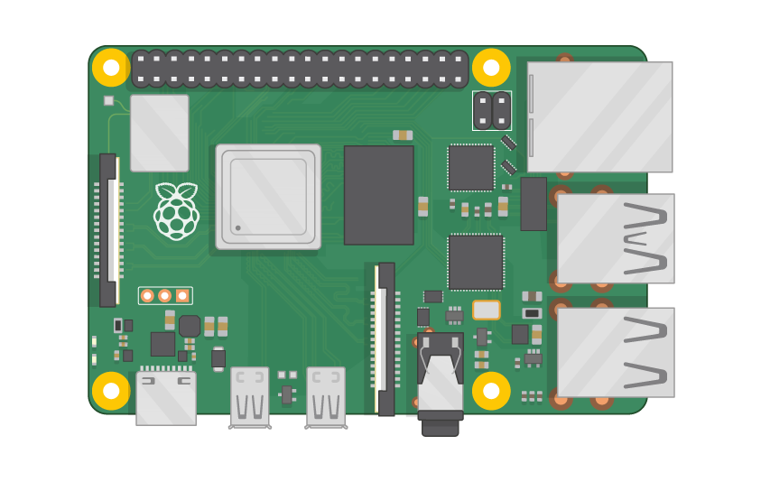{:width="250px" :height="150px"} | 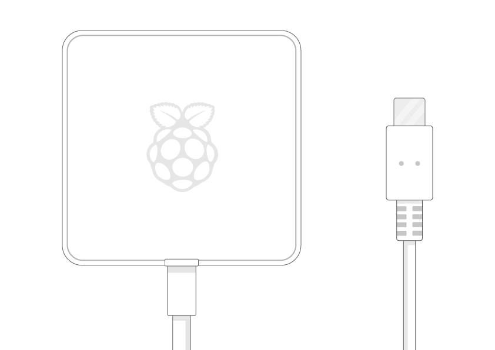 |  | 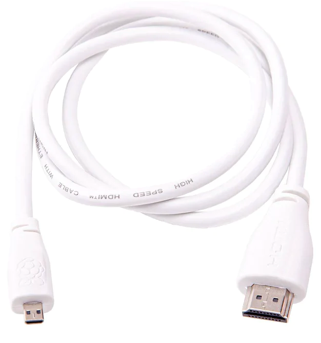 |

| 1x Sense HAT (V2) | 1x Tall header pins | 
|:--------:|:-------:|
|  | 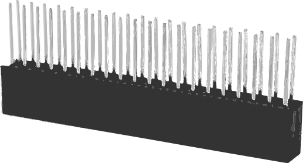 |

If your experiment uses the camera, you will also have:

| 1x HQ Camera Module | 1x 6mm Camera Lense |
|:--------:|:-------:|
|  | 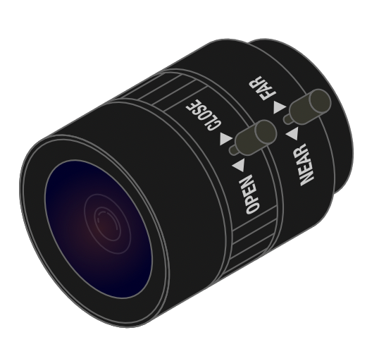 |

and if you will be using infra-red photography, your kit will also include:

| 1x red optical filter | 1x allen key (1.5mm) |
|:--------:|:-------:|
| 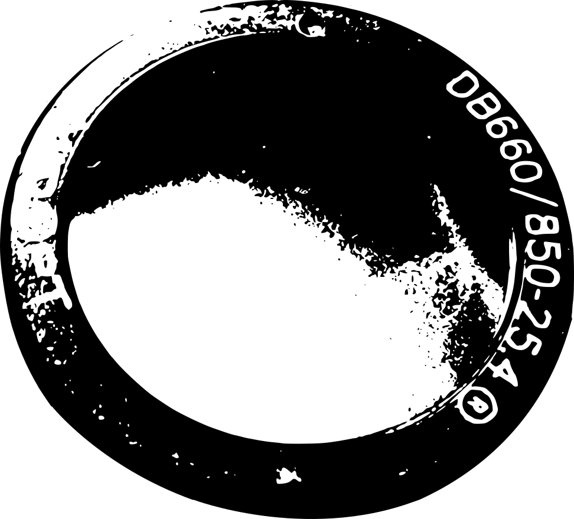 | 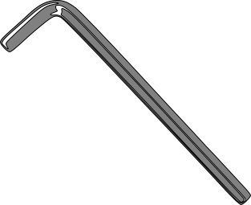 |

If your experiment detects movement or involves machine-learning at runtime, you may also have some of the following in your box:

| A passive infrared (PIR) motion sensor | 3x female-female jumper wires | A [Coral USB Accelerator](https://coral.ai/products/accelerator) | 1x USB-C to USB-A cable |
|:--------:|:-------:|:--------:|:--------:|
|  |  | 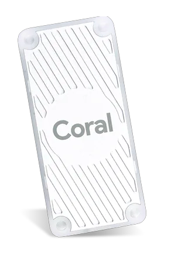 | 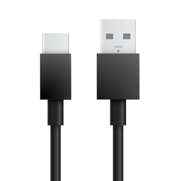 |

If you want to, you can [make a 3D-printed flight case](https://projects.raspberrypi.org/en/projects/astro-pi-flight-case-mk2){:target="_blank"}, and use this to even more closely simulate the ISS environment for more realistic testing. However, you don't need one to take part in Mission Space Lab. 

--- /collapse ---

## Method

We will start by connecting the Camera "ribbon" cable to the Raspberry Pi, if you were supplied with a camera. Then, we will put on the Sense Hat. Finally, we'll finish by connecting the camera module and the PIR sensor, if you have them.

--- task ---
1. Unpack everything from your kit and make a note of whether your box includes the camera module, a Coral TPU dongle, or a PIR motion sensor.

- My box contains a camera <input type="checkbox" id="hasCamera">
- My box contains a PIR sensor <input type="checkbox" id="hasPir">
- My box contains a Coral dongle <input type="checkbox" id="hasCoral">
--- /task ---

--- collapse ---
---
title: Optional step - my box contains a camera
---

--- task ---
1a. Insert the camera ribbon cable into the CSI (Camera Serial Interface) socket on the Raspberry pi.  

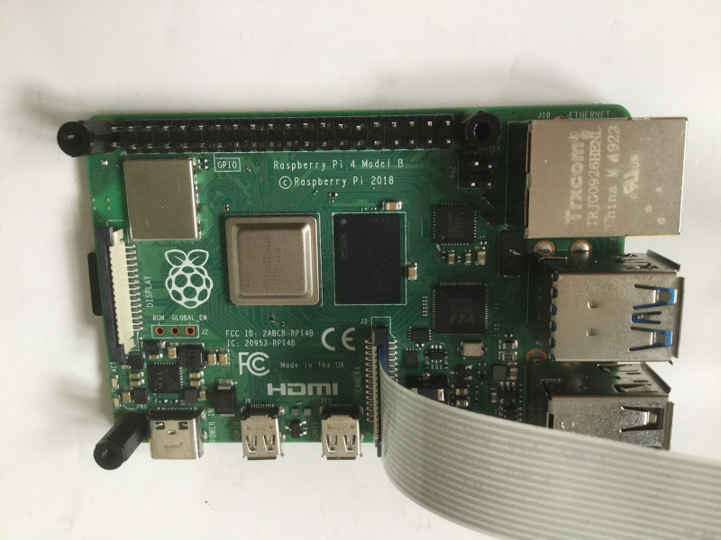
--- /task ---

--- /collapse ---

[[[rpi-picamera-connect-camera]]]

We are going to assemble the Sense Hat, which will roughly look like this:

--- task ---
2. Take the black hexagonal spacer columns from the small bag that comes with the Sense HAT. Use the accompanying screws to connect them to the bottom of the Raspberry Pi 4.

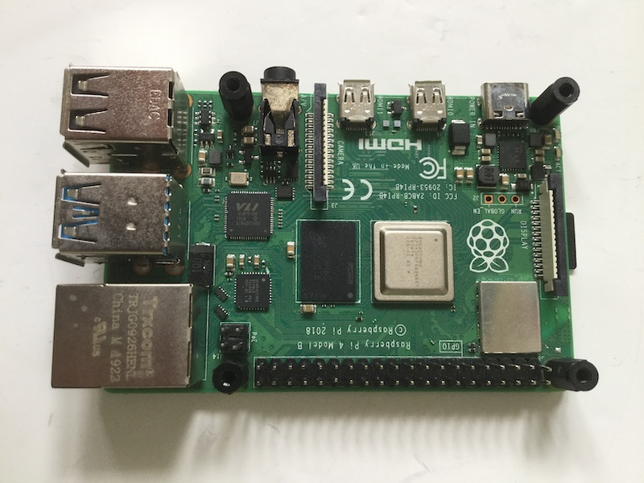
--- /task ---

--- task ---
3. Take the Sense HAT and remove the short header if it is attached.

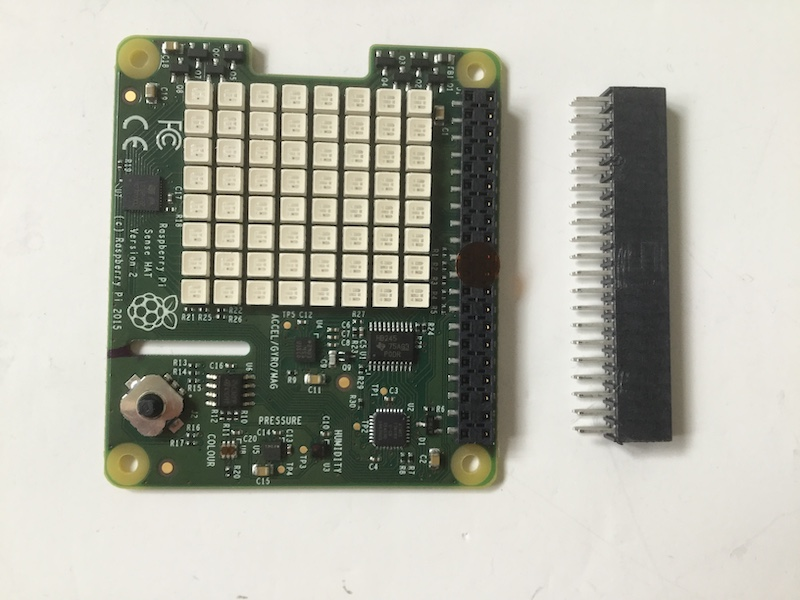
--- /task ---

--- task ---
4. Line up the tall header with the corresponding holes on the Sense HAT.  

--- /task ---

--- task ---
5. Push the header all the way through. Make sure none of the pins are obstructed and that they are lined up correctly so that they do not become bent.  

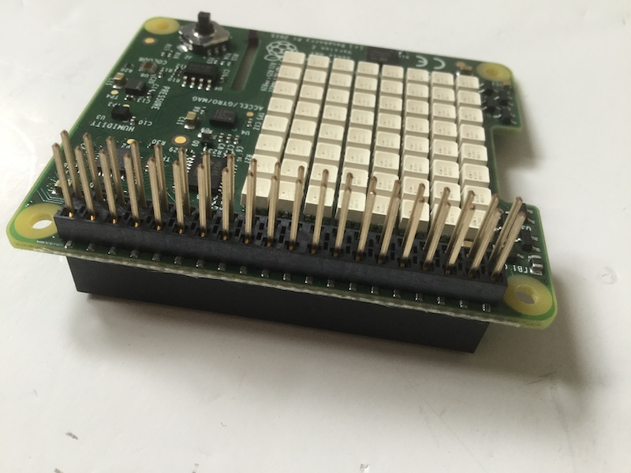
--- /task ---

--- collapse ---
---
title: Optional step - My box contains a camera
---
--- task ---
5a. Feed the camera cable through the slot on the Sense HAT and then sit the Sense HAT onto the Raspberry Pi device. Make sure that all 40 GPIO pins line up with the corresponding holes in the tall header.   

<iframe width="560" height="315" src="https://www.youtube.com/embed/VzYGDq0D1mw" frameborder="0" allow="accelerometer; autoplay; encrypted-media; gyroscope; picture-in-picture" allowfullscreen></iframe>

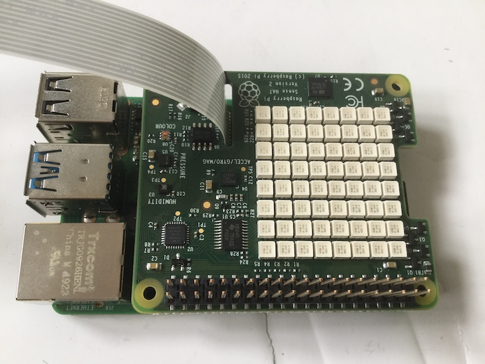
--- /task ---

--- /collapse ---

