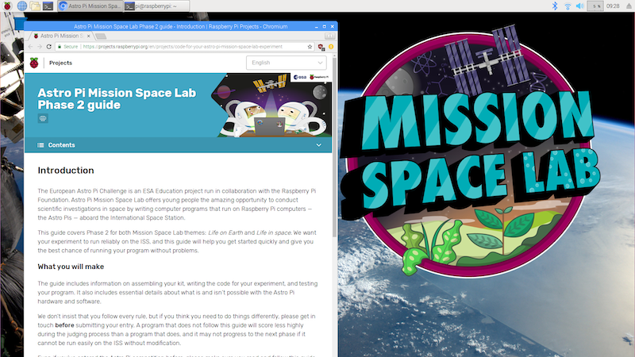

## Getting started

If you have received an official Astro Pi kit from ESA, you have everything you need to develop and test your Phase 2 program for Mission Space Lab (MSL). If you want to, you could even [create your own Astro Pi flight case](https://projects.raspberrypi.org/en/projects/astro-pi-flight-case), but don’t worry, that’s not essential. It can be a valuable activity in its own right, but completion of Mission Space Lab **does not** rely on having the flight case.

The first thing you'll need to do is set up your development environment. If you received a kit from ESA, it will contain a Raspberry Pi with an SD card that already has the Raspbian operating system installed. In order to make sure the setup of your Pi matches that of the Astro Pis on the ISS, you'll need to install the extra libraries and software listed below. To make this easy, we've written a one-line installer script that will do everything in one go and make sure the correct versions are installed. Here's how to run the script:

1. Turn on the Pi and log in (username: "pi", password: "raspberry")
2. When you log in for the first time, a wizard program will open and ask to walk you through choosing settings like your language, keyboard type, and WiFi details; let the wizard guide you through this process
3. Start the Chromium web browser (click on the blue globe next to the Raspberry Pi symbol in the top left-hand corner of the screen) and test whether your Pi is connected to the internet
4. Open a terminal window (click on the black box icon in the top bar of the screen)
5. Type in the following command and press Press <kbd>Enter</kbd> to run the one-line installer that will add all the extra Python libraries and software:
```bash
curl -sSL http://rpf.io/apstretch | bash
```
6. Close and then re-open Chromium, and you should see this guide displayed as the starting page.



### Using the hardware

You may wish to revisit the videos from Phase 1 to remind yourself of the limitations of the Astro Pi hardware aboard the ISS. We also have the following resources to help you get started with the Sense HAT and Camera Module:

[[[rpi-sensehat-attach]]]

If you've never used the Sense HAT before, [start with this short project](https://projects.raspberrypi.org/en/projects/getting-started-with-the-sense-hat/), and come back here once you're aware of basic Sense HAT uses.

[[[rpi-picamera-connect-camera]]]

Note that, because you will be using the Raspberry Pi Camera Module with the Sense Hat, you'll need to thread the camera's ribbon cable through the slot on the Sense HAT before connecting it the Pi.

If you've never used the Camera Module before, [start with this beginners' project](https://projects.raspberrypi.org/en/projects/getting-started-with-picamera/), and come back here once you've tried your hand using the basic `picamera` Python library functions.

## Performance

The Raspberry Pis in the ESA kits for Astro Pi 2018/19 are Raspberry Pi 3s. However, the Astro Pis currently on the ISS are the older Raspberry Pi model B+. A Pi 3 is a new model, and therefore faster and more powerful than a B+. You should bear this in mind when writing the code for your experiment: some tasks that need a lot of computing power (e.g. they involve complicated mathematics or the processing of lots of data) will run more slowly on the Astro Pis on the ISS than on your ESA kit Pi. In particular, using Python libraries like `OpenCV` (to process images captured with the Pi camera), or `ephem` (to work out which city the ISS is passing over) will be significantly slower on the Astro Pis.  

See the "Test your code" section for instructions for creating a test SD card image that is more representative of the performance of the Astro Pis on the ISS.

## Write your program

Next, you will write the program for your experiment. To do this, you'll need to plan your coding sessions, understand the best way to write the program for your experiment, and ensure that it will work on the Astro Pis on the ISS. To help with planning, we've put together a teachers' and mentors' guide for Phase 2 that provides useful tips for facilitating your team’s coding of their experiment.

### Which version of Python should you use?

Programs for all MSL challenge entries must be written in **Python 3**.

If you find a Python library that you need for your experiment and that is Python 2 only, please contact us — we will help you find an alternative approach.

### Using additional Python libraries

In addition to the default Python libraries that are available on Raspbian, the following Python libraries are also installed on the Astro Pis on the ISS.

- [numpy](https://docs.scipy.org/doc/){:target="_blank"}
- [scipy](https://docs.scipy.org/doc/){:target="_blank"}
- [tensorflow](https://www.tensorflow.org/api_guides/python/){:target="_blank"}
- [pandas](https://pandas.pydata.org/pandas-docs/stable/api.html){:target="_blank"}
- [opencv-python](https://opencv-python-tutroals.readthedocs.io/en/latest/){:target="_blank"}
- [opencv-contrib-python](https://pypi.org/project/opencv-contrib-python/)
- [evdev](https://python-evdev.readthedocs.io/en/latest/){:target="_blank"}
- [matplotlib](https://matplotlib.org/){:target="_blank"}
- [logzero](https://logzero.readthedocs.io/en/latest/){:target="_blank"}
- [pyephem](http://rhodesmill.org/pyephem/) {:target="_blank"}
- [scikit-image](http://scikit-image.org/docs/dev/){:target="_blank"}
- [scikit-learn](http://scikit-learn.org/stable/documentation.html){:target="_blank"}
- [reverse-geocoder](https://github.com/thampiman/reverse-geocoder){:target="_blank"}

Note that no other libraries can be used. If your experiment requires other Python libraries, please contact us and we will try you help you find an alternative approach.

Some Python libraries may include functions that perform a web request to look up some information or return a value that is dependent on time or location. Even though they may be very useful, these are not permitted (see the Networking section of this guide).  

### What to call your Mission Space Lab Python files

When you submit the program for your MSL experiment, your main Python file should be called `astropi_main.py`.

Ideally, all you code should be contained within this file. However, if your experiment is very complex, then additional files are allowed.

### Documenting your code

When you’ve created a really useful program or piece of software and you want to share it with other people, a crucial step is creating documentation that helps people understand what the program does, how it works, and how they can use it. This is especially import for your MSL experiment, because it should be obvious from your program how you will achieve your experiment's aims and objectives.

This [project](https://projects.raspberrypi.org/en/projects/documenting-your-code) shows you the recommended way to add useful comments to your program.

Any attempt to hide, or make it difficult to understand, what a piece of code is doing will result in disqualification. And of course there should be no bad language or rudeness in your code.
