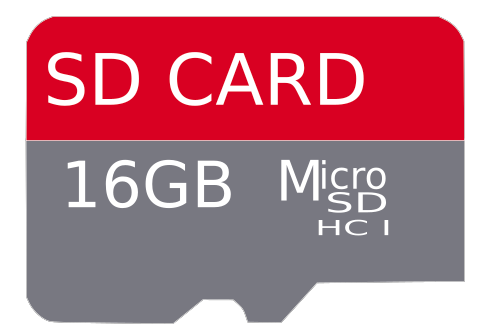
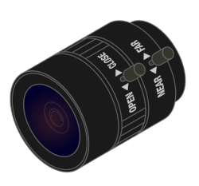

## Kit Assembly

In this step we are going to build a real Astro Pi using the official Astro Pi kit you received from ESA. We understand that building your Astro Pi can be intimidating, which is why we have created the handy guide & checklist below for you to follow!

--- collapse ---
---
title: What's in the box?
---
It may be small but your kit box really packs a punch! Your official Astro Pi kit includes:

| 1x [Raspberry Pi 4](https://www.raspberrypi.com/products/raspberry-pi-4-model-b/) 4GB | 1x Power Supply Unit | 1x 16GB Micro SD card | 1x HDMI cable |
|:--------:|:-------:|:--------:|:--------:|
|  |  |  |  |

| 1x Sense HAT (V2) | 1x Tall header pins | 
|:--------:|:-------:|
|  |  |

If your experiment uses the camera, you will also have:

| 1x HQ Camera Module | 1x 6mm Camera Lense |
|:--------:|:-------:|
|  |  |

and if you will be using infra-red photography, your kit will also include:

| 1x red optical filter | 1x allen key (3mm) |
|:--------:|:-------:|
| 1x red optical filter |  |

If your experiment detects movement or involves machine-learning at runtime, you may also have some of the following in your box:

| A passive infrared (PIR) motion sensor | 3x female-female jumper wires | A [Coral USB Accelerator](https://coral.ai/products/accelerator) | 1x USB-C to USB-A cable |
|:--------:|:-------:|:--------:|:--------:|
|  |  |  |  |

If you want to, you can [make a 3D-printed flight case](https://projects.raspberrypi.org/en/projects/astro-pi-flight-case-mk2){:target="_blank"}, and use this to even more closely simulate the ISS environment for more realistic testing. However, you don't need one to take part in Mission Space Lab. 

--- /collapse ---

