## Kit Assembly

<iframe width="560" height="315" src="https://www.youtube.com/embed/cFhmKzV_QZs" frameborder="0" allow="accelerometer; autoplay; encrypted-media; gyroscope; picture-in-picture" allowfullscreen></iframe>

In this step we are going to build an Astro Pi using the official kit you received. Before starting the assembly, let's familiarise ourselves with what's in the box...

--- collapse ---
---
title: What's in the box?
---
It may be small but your kit box really packs a punch! Your official Astro Pi kit includes:

| 1x [Raspberry Pi 4](https://www.raspberrypi.com/products/raspberry-pi-4-model-b/) 4GB | 1x Power Supply Unit | 1x 16GB Micro SD card | 1x HDMI cable |
|:--------:|:-------:|:--------:|:--------:|
|  | 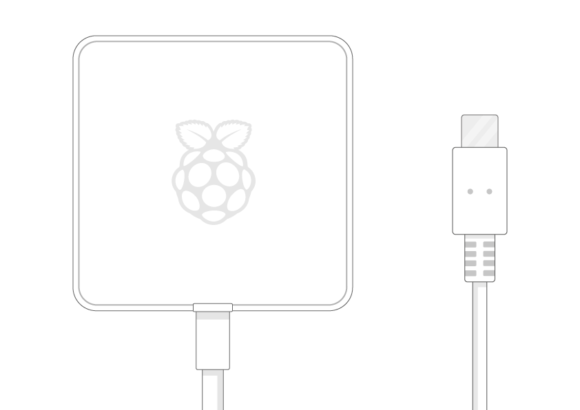 |  |  |

| 1x Sense HAT (V2) | Bag of spacers, screws, and a GPIO header
|:--------:|:-------:|
|  | 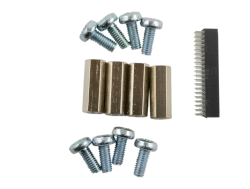 |

 
If your experiment involves using the camera, you will also have:

| 1x HQ Camera Module | 1x 6mm Camera Lense |
|:--------:|:-------:|
|  |  |

 
and if you will be using infra-red photography, your kit will also include:

| 1x red optical filter | 1x allen key (1.5mm) |
|:--------:|:-------:|
| 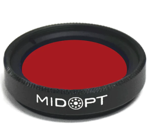 |  |

 
If your experiment involves detecting movement, your kit will include:

| A passive infrared (PIR) sensor | 3x female-female jumper wires | 1x Tall header pins |
|:--------:|:-------:|:--------:|
| 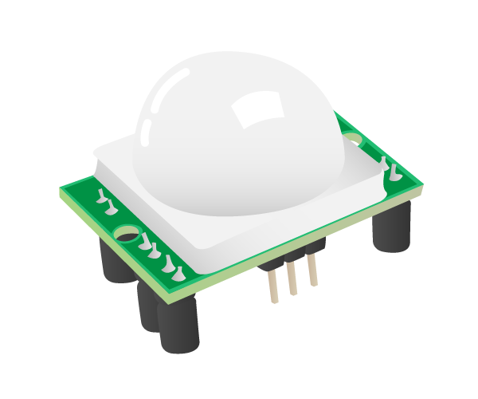 | 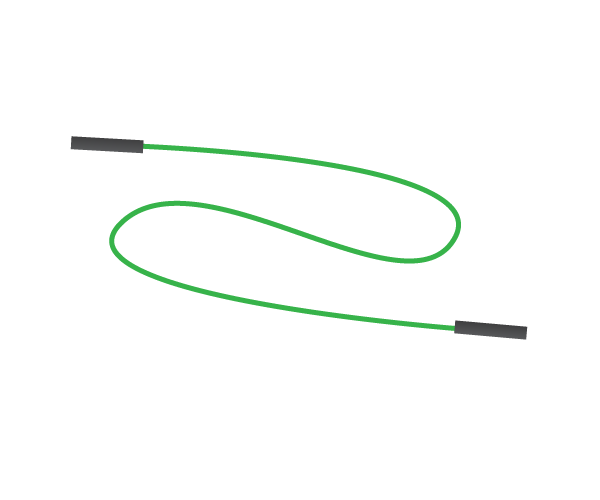 |  |

 
If your experiment involves machine-learning at runtime, you will also have the following in your box:

| A [Coral USB Accelerator](https://coral.ai/products/accelerator) | 1x USB-C to USB-A cable |
|:--------:|:-------:|
|  |  |

 
If you want to, you can [make a 3D-printed flight case](https://projects.raspberrypi.org/en/projects/astro-pi-flight-case-mk2){:target="_blank"}. However, you don't need one to take part in Mission Space Lab. 

--- /collapse ---

## Method

Before getting started, familiarise yourself with what's in the box and unpack everything. Make a note of whether your box includes the camera module, a Coral TPU accelerator, or a PIR sensor using the checkboxes below. This will show or hide the relevant assembly instructions accordingly.

- My box contains a camera <input type="checkbox" id="hasCamera">

  - My box contains an infrared filter<input type="checkbox" id="hasInfrared">

- My box contains a PIR sensor <input type="checkbox" id="hasPir">
- My box contains a Coral accelerator stick <input type="checkbox" id="hasCoral">

--- task --- 
Place the Raspberry Pi 4 on a flat surface. Make sure it is turned off with nothing plugged in.
--- /task ---

### Attaching the Sense Hat

We are going to start by assembling the Sense HAT.
{: style="max-width: 50%;" }

--- task ---
Find the Sense HAT and the small bag that comes with it that includes some screws and spacers, as well as a regular GPIO header.

Remove any stickers on the top of the Sense HAT.

--- /task ---

--- task ---
Take the black hexagonal spacer columns from the small bag that comes with the Sense HAT. Use the accompanying screws to connect them to the bottom of the Raspberry Pi 4.

--- /task ---

--- task ---
In a separate bag, locate the tall GPIO header. We will use this header instead of the regular header to allow enough space for the PIR sensor.

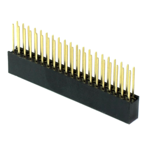
--- /task ---

--- task ---
Line up the header with the corresponding holes on the bottom of the Sense HAT.  

--- /task ---

--- task ---
Push the header all the way through, making sure none of the pins are obstructed and that they are lined up correctly so that they do not become bent.  

--- /task ---

--- task ---
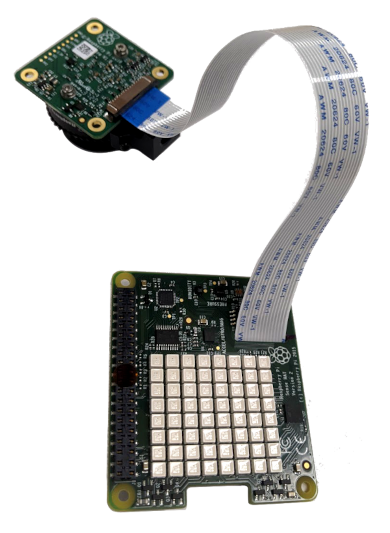

With the Raspberry Pi High Quality Camera and connector cable unboxed, take the connector cable and feed it through the gap in the Sense HAT. The silver side of the connector cable should face the LED matrix and not the blue side.

Here is a video of the process:
<iframe width="560" height="315" src="https://www.youtube.com/embed/VzYGDq0D1mw" frameborder="0" allow="accelerometer; autoplay; encrypted-media; gyroscope; picture-in-picture" allowfullscreen></iframe>
--- /task ---

--- task ---
Find the CSI (Camera Serial Interface) port on the Raspberry Pi and gently pull the edges of the port's plastic cap.

--- /task ---

--- task ---
{: style="max-width: 80%" }
Insert the camera ribbon cable into the Raspberry Pi CSI socket, making sure that the silver side (and not the blue side) is facing the LED matrix. There should be 1 or 2mm of silver still remaining when the cable has been put in correctly.
Then, push the plastic clip back into place.

--- /task ---

--- task ---
Place the Sense HAT onto the Raspberry Pi and ensure the 40 GPIO pins line up with the corresponding holes in the header.

--- /task ---

--- task ---
Use the four remaining black screws to secure the Sense HAT stack to the spacers. 

--- /task ---

We've finished putting the Sense HAT on. On to the next step.

### Passive infrared (PIR) sensor

--- task ---
Take the PIR and remove the foam pin protector block. 

--- /task ---

--- task ---
Take a moment to familiarise yourself with the [layout of the Raspberry Pi pins](https://pinout.xyz). Notice that the odd-numbered pins are on the left, the even-numbered pins are on the right, and that the pin number increases by 2 each time we go down a row. 

Take a moment to look at the PIR sensor. Do you see the labels GND, VCC, and OUT?

--- /task ---

--- task ---
Now we are going to connect each pin on the PIR sensor to an appropriate pin on the Raspberry Pi using the three female-female jumper wires provided in the kit.

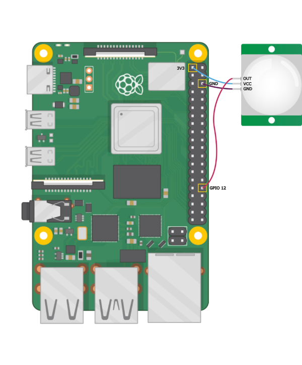

- Connect the VCC pin on the PIR sensor to pin 1 (3V3) on the Raspberry Pi
- Connect the GND pin on the PIR sensor to pin 6 (GND) on the Raspberry Pi
- Connect the OUT pin should be connected to pin 32 (GPIO 12)

**Note**: Your jumper wires may be a different colour to the ones in the photos - the colour doesn't matter, don't worry!

Here is a video of the PIR setup:
<iframe width="560" height="315" src="https://www.youtube.com/embed/bezyRA3uHiY" frameborder="0" allow="accelerometer; autoplay; encrypted-media; gyroscope; picture-in-picture" allowfullscreen></iframe>

--- /task ---

You've just finished assembling the PIR sensor - great work!

### Setting up the Coral Machine Learning accelerator

--- task ---
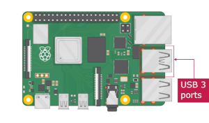
Good news - the Coral accelerator stick requires no assembly! 
Simply locate the USB-C cable and plug it into the accelerator

{: height="450px" width="253px" class="small-img" }

 
and then plug the other end into any of the blue USB (USB 3) ports.

--- /task ---

### Camera assembly

--- task ---
 
Find the high quality camera board and check that the back focus ring is screwed all the way in. 

--- /task ---

--- task ---
Remove the protective cap from the high-quality camera. 

--- /task ---

--- task ---
Remove the C/CS adapter ring from the high-quality camera. 

--- /task ---

### Converting the camera to use infrared

If your Life on Earth experiment requires an infrared-sensitive (IR-sensitive) camera - for example, you are doing a NDVI (Normalized Difference Vegetation Index) experiment - then you will need to convert your camera using the steps below.

**Note**: If you are programming a Life in Space experiment, or your Life on Earth experiment requires photos to be taken in the visible light spectrum only, then please don't convert your high-quality camera sensor as you can't reverse/undo it later!

--- collapse ---
---
title: How does the infrared camera work?
---
The high-quality camera sensor can detect infrared (IR) light. However, the sensor housing contains an IR filter, which is used to greatly reduce the camera’s sensitivity to IR light.  This is so that the images captured by the high-quality camera sensor look the same as what we see with our eyes (which are not sensitive to IR light). By removing this filter we allow the IR light to pass through along with visible light.

In the next steps we will replace the built-in filter with a separate red filter which allows only reflected red light (660nm) and reflected near-infrared light (850nm) through to the sensor.  See our [NDVI project](https://projects.raspberrypi.org/en/projects/astropi-ndvi) for more information. 

--- /collapse ---

--- task ---
Remove the built-in infrared filter from the high-quality camera by following the [instructions here](https://www.raspberrypi.org/documentation/accessories/camera.html#raspberry-pi-hq-camera-filter-removal). You will need to use the 1.5mm allen key.

To help you even more, here is a video of this process:
<iframe width="560" height="315" src="https://www.youtube.com/embed/tAk0Q3jR_aQ" frameborder="0" allow="accelerometer; autoplay; encrypted-media; gyroscope; picture-in-picture" allowfullscreen></iframe>
--- /task ---

--- task ---
 
Take the MIDOPT filter and sit it onto the hole in the centre of the high-quality camera sensor.

--- /task ---

--- task ---
 
Gently start turning the filter clockwise using just your fingers, so that the filter screws down into the high-quality camera sensor. Take care not to touch the glass part of the lens and leave greasy fingerprints!

--- /task ---

--- task ---
 
Take the tool provided with the filter and line up the two knobbly bits at each end with the corresponding dimples in the filter. If you have a 3D printer, you might like to print a handle for the tool to make it easier to grip. One of these handles has been printed and sent to the ISS for the astronauts to use when completing the task — but it isn't required. 

--- /task ---

--- task ---
 
Continue gently turning the filter using the tool. Take care not to touch the glass part of the lens with the tool — it will scratch it!

--- /task ---

--- task ---
 
You should start to feel increasing resistance as the filter gets lower. After about nine full turns, the filter should be as low as it can go and you won't be able to turn it any further. Be careful not to over-tighten. 

--- /task ---

--- task ---
Remove the cap from the narrower end of the 6mm lens 

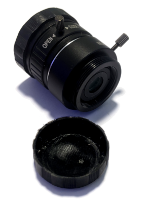
--- /task ---

--- task ---
Screw the 6mm lens onto the high-quality camera sensor. 

--- /task ---

Congratulations! Now you have a complete infrared-sensitive camera!

### Final assembly steps

You're almost done, finish your Astro Pi with these steps!

--- task ---
Connect your keyboard and mouse into the two (black) USB 2 ports.
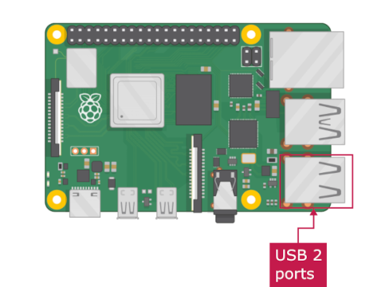
--- /task ---

--- task ---
Connect the little micro-HDMI cable into the HDMI 1 port of the Raspberry Pi and connect the other end into your screen.

--- /task ---

--- task ---
{: class="small-img"}

The SD card comes in a large adapter, so remove it from the adapter and insert it into the SD port on the bottom of the Raspberry Pi - make sure you put it in the right way!

--- /task ---

--- task ---
Finally, connect the USB-C power cable into the Raspberry Pi and watch it boot up!
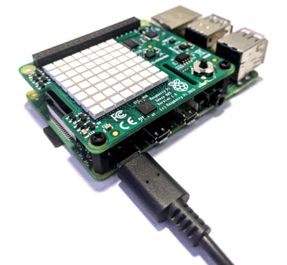
--- /task ---

Congratulations, you have made an Astro Pi! 🚀
Continue to the next stage to learn about the Operating System, the Kit OS.

