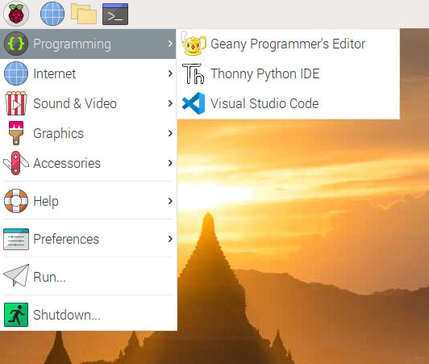
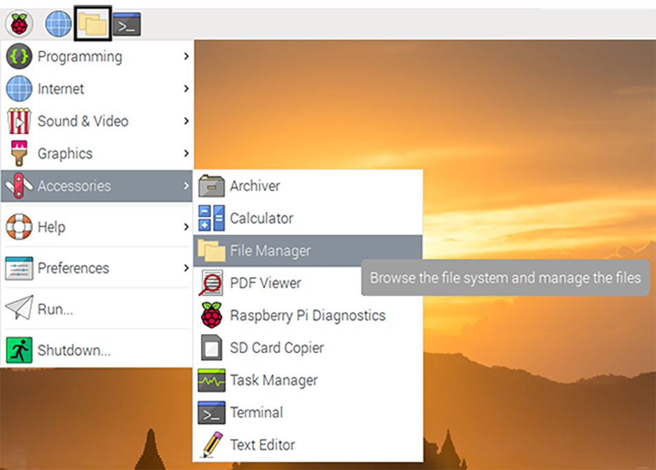

## The Kit OS

### Setting up your OS

When you power on your Astro Pi for the first time you will be invited to accept the ESA License Agreement, as shown below:


Once you have accepted the licence agreement, you will be asked to create a new username and password, to set the system time and language settings, and to connect to a WiFi network. For more help on setting up your Raspberry Pi, take a look at [this guide](https://projects.raspberrypi.org/en/projects/raspberry-pi-getting-started/4).


After you have completed these steps, the Astro Pi will reboot itself and you will be ready to start using the Kit OS! 🚀

--- collapse ---
---
title: Optional setup - Accessing the Desktop Flight OS remotely
---

The Kit OS can be configured so that you are able to connect to it from another desktop. To do this, you will need to install a [compatible VNC client](https://www.realvnc.com/en/connect/download/viewer/) on the other desktop, and then enable VNC on the Astro Pi itself by entering the commands below.

The default password to connect via VNC is `raspberry` but you are *highly encouraged* to change this using `vncpasswd -service` before enabling VNC.

```bash
sudo raspi-config nonint do_vnc 0
sudo systemctl enable novnc
sudo systemctl start novnc
sudo systemctl unmask avahi-daemon
sudo systemctl enable avahi-daemon
sudo systemctl start avahi-daemon
```

You can also connect to the Desktop Flight OS using just a browser, albeit less-securely. On a machine that is connected to the same network as your Astro Pi kit, open up a browser and type `https://astro-pi-kit.local/vnc.html` in the address bar. 
You will have to tell your browser to trust your unique Astro Pi SSL certificate to continue (e.g. on Chrome, type `thisisunsafe` while the browser tab has focus), but once you have done so you will be lead to the noVNC connection page. Click on the `Connect` button, enter the password you set in `vncpasswd`, and you should see the Flight OS desktop in your browser!


--- /collapse ---


<p style="border-left: solid; border-width:10px; border-color: #fa1111; background-color: #f56c6c; padding: 10px;">
**Note**: Be careful about installing new software on your Kit OS, as it will make it more likely your experiment won't run successfully on the Astro Pis aboard the ISS.

But, if you have accidentally installed anything, you can always redownload and reinstall the Kit OS and start again

</p>

--- collapse ---
---
title: Optional - Downloading a fresh version of the Kit OS
---

If you want to create additional SD cards to use for Astro Pi, or if you accidentally installed something, you can download the [Desktop Flight OS image file](https://downloads.raspberrypi.org/AstroPi_latest) used in the ESA kits. After downloading, you can use any software tool to write the image file to your own SD card. See [this guide](https://www.raspberrypi.org/documentation/installation/installing-images/) for instructions on how to do this.

--- /collapse ---

Now it's time to take a tour of the OS!

### A tour of the OS

The Kit OS is a special version of the Raspberry Pi Desktop OS (Bullseye 32 bit) that contains the same programs and libraries as the Astro Pis aboard the International Space Station.  It includes everything you need to **develop** and **test** your experiment, and more!
Making sure that your program runs successfully in this environment is the best way to ensure that your experiment can run on the Astro Pis on the ISS.

### Applications

There are a lot of applications that are installed in the Kit OS - take a moment to explore the start menu in the top-left corner. Can you find the following applications?



--- collapse ---
---
title: Thonny
---
Thonny is a Python IDE ([Integrated Development Environment](https://simple.wikipedia.org/wiki/Integrated_development_environment)), and is easy to use to get started writing your experiment program.


--- /collapse ---

--- collapse ---
---
title: Visual Studio Code
---
Visual Studio Code is a [text editor](https://simple.wikipedia.org/wiki/Text_editor) and can be used to write programs in many programming languages, including Python. It isn't quite as beginner-friendly as Thonny, but you could also use this to write your program.

--- /collapse ---

--- collapse ---
---
title: File Manager
---
The File Manager is used to ... manage files! Every file on your computer can be accessed using this application. For more information, check out [this page](https://projects.raspberrypi.org/en/projects/raspberry-pi-using/7)

--- /collapse ---

--- collapse ---
---
title: Chromium
---
Chromium is the default web-browser on Raspberry Pi OS - use it to get help preparing your experiment!

--- /collapse ---

--- collapse ---
---
title: Terminal
---
Terminal is an application that you can use to run other programs and automate almost any task on your computer. As an example to get started, type `python3` to open up a python interpreter. Check out [this page](https://projects.raspberrypi.org/en/projects/raspberry-pi-using/8) for more information about the Terminal.


--- /collapse ---

### Python & Python Libraries

--- collapse ---
---
title: What is Python?
---
Python is the general purpose programming language that you will use to run your experiment! Python programs are instructions formed of special words telling the computer what to do. Using Python you can do almost anything you can imagine! The application that runs a Python program is called the _interpreter_. If this is your first time with Python, check out [this project](https://projects.raspberrypi.org/en/codeclub/python-module-1).
--- /collapse ---

The Kit OS comes with Python version 3.9.2 and many additional Python _libraries_ pre-installed to help you write the program for your experiment. The same Python and library versions have been installed on the Astro Pis aboard the ISS, so running your program on the Kit OS should behave similar as it would in space! 

<p style="border-left: solid; border-width:10px; border-color: #ff8f00; background-color: #d17500; padding: 10px;">
Because the ISS is a very secure environment, these are the only libraries that you will be allowed to use in your experiment if it runs on the Astro Pis on board. Please [contact us](mailto:enquiries@astro-pi.org) if you think anything is missing or have any suggestions!
</p>

### Python libraries

--- collapse ---
---
title: What is a Python library?
---
A 'library' or 'package' is a collection of program 'blocks' that solve a specific problem or achieve a specific goal. You use them by 'importing' them into your Python program: `import numpy as np`, for example. Using libraries avoids having to solve the same problem twice, and makes the process of programming easier.

--- /collapse ---

Take some time now to familiarise yourself with the libraries available to use on the Astro Pis, which are listed below. Each library is briefly described and is presented with an example of how to use it, together with links to external documentation where you can learn more. Don't worry if this is a lot of information - bookmark this page for later!

