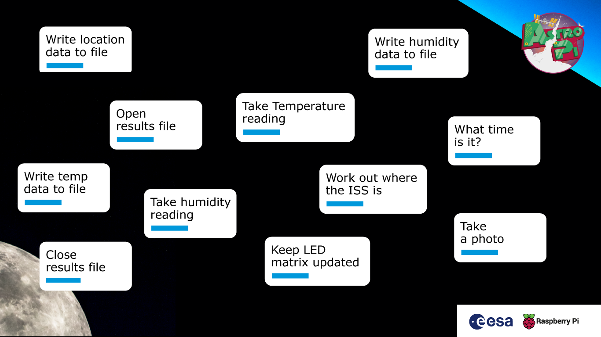
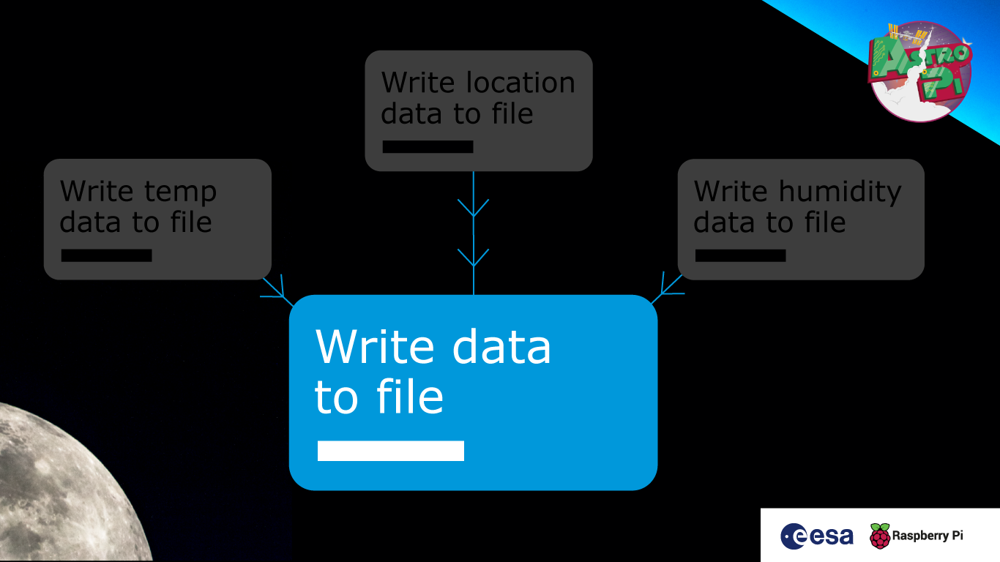
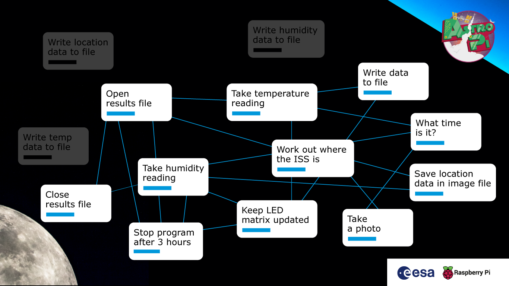
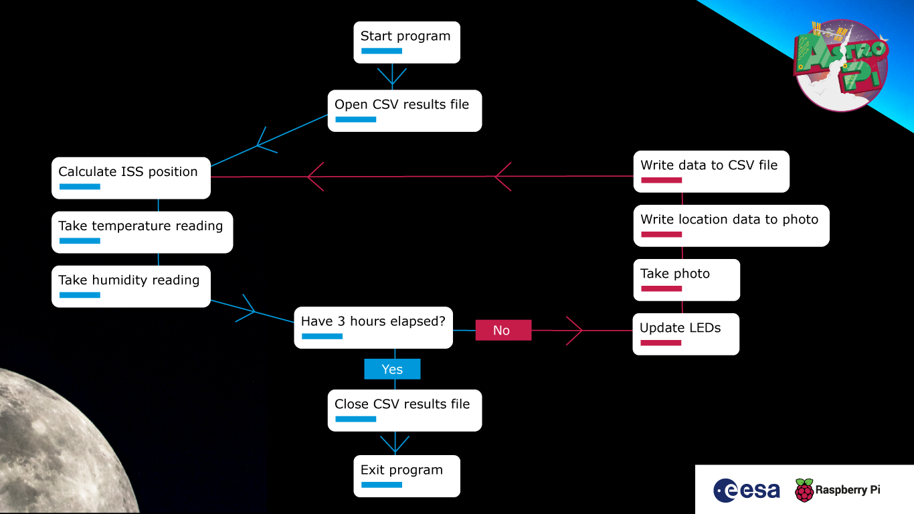

## Writing your program

Now you can start writing the program for your experiment. To do this, you'll need to plan your coding sessions, understand the best way to write the program for your experiment, and ensure that it will work on the Astro Pis on the ISS. 

To help with planning, we've put together a guide for Phase 2 that provides useful tips for facilitating your team's coding.

--- collapse ---
---
title: Tips for planning and running coding sessions
---

Here is an example of an Astro Pi Mission Space Lab experiment idea, which will be used to illustrate how to plan and write your computer program (this is the experiment that the program shown in the step 'A big worked example' comes from).

The team from CoderDojo Tatooine wants to investigate whether the environment on the ISS is affected by the surface of the Earth that it is passing over. Does the ISS get hotter when it passes over a desert, or wetter (more humid) when it is above the sea?

Their computer program should:
- Take regular measurements of temperature and humidity every 30 seconds, and log the values in a CSV file.
- Calculate the ISS’s latitude and longitude using the PyEphem library, and log this information in the CSV file.
- Take a photo using the IR camera on Astro Pi computer Izzy, which is pointing out of a window towards Earth, to gather data on whether cloud cover might also be a factor.
- Write the latitude and longitude data into the EXIF tags of the images, which have sequentially numbered file names.
- For a 'Life in space' experiment, update the Astro Pi’s LED matrix every 15 seconds. 'Life on Earth' experiments should not use the LED matrix.
- Handle any unexpected errors and log the details.

### How to approach writing the program for Phase 2 of Mission Space Lab

+ First, look at the coding guidelines in the steps in this project. They contain a few things that your program should do so that it can run smoothly on the Astro Pis on the ISS, along with some useful tips for how to make the most of your experimental results. There are also a few strict rules, such as making sure that all of the photos that Astro Pi Ed takes of the inside of the ISS are deleted at the end of your experiment.

Remember, these are some key things that the program should do:

1. The complete program should be in a single file.
1. Results should be saved to a CSV file.
1. Photos from Astro Pi Izzy should have the ISS location information added to their metadata.
1. The use of multiple threads should be avoided.
1. The Astro Pi’s LED matrix should be updated regularly to indicate that the program is working ('Life in space' only).
1. The program should finish after 3 hours.

### Work out the key tasks

+ Get your team together and start to map out the rough outline of how your program will work. You could do this as a group and have everyone call out their ideas, or all team members could work individually and then get together to compare results.

+ Use a whiteboard or big sheet of paper to list all of the key tasks that your program will need to perform. You don’t need to worry about the order or the actual functions and commands at this stage — just note down the specific things that need to be achieved. This is what that would look like for the example scenario above:



+ Now have a closer look at each task and think about whether it can be split into smaller subtasks. Moreover, are there any actions that can be sensibly combined with one another? Also, see if there are any tasks that need to be repeated.



+ Now try to put everything into a logical order, using lines to connect the various tasks. It will start to get messy, but that’s good! You will probably discover that there are some obvious repeated tasks. This is a good time to introduce or reinforce the programming concepts of repetition and loops.



+ If there are any repeated tasks, do they appear just once in your diagram, with flow lines passing through many times, or do they fit in in multiple places? Talk with your team about how repeated tasks should only be coded once, so that parts of the program can be reused.

### Create a flow chart

+ Take a fresh sheet of paper or find a clean area on your whiteboard (be sure to copy or take a photo of your first picture before you erase anything). Reconfigure the steps and flow into a more ordered diagram, maybe running clockwise around the paper or starting at the top and working downwards. Try a few different versions and see which one is the most easy to follow. Include a ‘start’ and ‘end’ block to make it very clear where the program begins and finishes. Are there any actions that you need to perform at these stages (e.g. clear the LED matrix)?

The final result is what is called pseudocode: a diagram of all of a program’s tasks, in the right order, that doesn’t contain any actual programming language commands.



+ Now work through your task list and try to identify any missing pieces.

+ You should also think about where in your program you should be looking to handle exceptions and errors. Most experiments will have a main loop that runs repeatedly over the 3-hour period. An unexpected error encountered in this loop could be disastrous if it causes the program to stop or stall and prevent further data collection. So, think of some ‘what if’ scenarios. For example, if you’re reading data from a sensor, what will happen if it gives you an unexpected result? Will your program cope with this? How are you dealing with hardware errors?

+ Add any missing functionality into your pseudocode.

### Assign tasks to members of the team

+ Give descriptive names to each task block.

+ Assign responsibility for each block to different members of the team. Try to think about the individual team members’ experience levels and programming ability and allocate tasks accordingly. Depending on the number of people in your team and the complexity of your program, it may be sensible to have more than one person allocated to a specific block or function.

+ Remember that someone needs to be responsible for the scaffold of the final program that will contain the various function calls in the right order.

### Get coding!

+ You will probably discover that some functions are really easy to create using the recommended Python libraries, perhaps even with only a single line. Others will be more complex, and we have included some useful code snippets in the coding requirements document (e.g. for adding latitude and longitude information to the EXIF data of a photo) that you can copy into your project. To design more complicated functions, if needed, you can use the same pseudocode approach that you used with the program as a whole.

+ Remind your team that they cannot install additional Python libraries or access the internet on the Astro Pi computers aboard the ISS, so they should not use any commands that make a web request or look up something from an online source.

+ Encourage each team member or subteam responsible for a specific part of the program to code their section so that works by itself, just like the examples in the coding requirements document. Suggest that they add comments and docstrings as they go along.

+ Get together regularly to discuss progress and work through any major challenges as a group. It is useful to update your pseudocode flow diagram to reflect any changes that your team realise are necessary as they write the actual program.


+ Keep the deadline for submitting your program in mind. If time is running out, are there any parts of your program that can be left out? If you are planning on performing analysis of results in real time, can this instead be done after your program has run, when you’ve got your results back?

### Test your program

+ Don’t forget to test your program using the Flight version of the OS. It’s a cut-down version of the Raspberry Pi OS, and it does not have X-Windows and many of the standard development tools installed. Testing your program using the Flight OS will let you check that none of the commands rely on files or libraries that aren’t present on the Astro Pis aboard the ISS.

--- /collapse ---

### Which version of Python should you use?

Programs for all MSL challenge entries must be written in **Python 3**.

If you find a Python library that you need for your experiment and that can only be used in Python 2, please contact us — we will help you find an alternative approach.

### Python libraries

We've installed a collection of Python libraries on the Astro Pi's OS. Here's some information on what you can use them for and where you can find the relevant documentation.

Remember that you can download the Astro Pi OS to get all of these libraries on your SD card. 

--- collapse ---
---
title: pyephem
---

#### Usage

You can download the telemetry data for the ISS flight path to use the `pyephem` library in your tests. When your code runs, it will tell you exactly where the ISS currently is.

Browse to, or download and open, [celestrak.com/NORAD/elements/stations.txt](https://www.celestrak.com/NORAD/elements/stations.txt) and copy and paste the first three lines as variables into your code to get the latest telemetry data for the ISS flight path. This data will be automatically updated when your code runs on the ISS.

```python
from ephem import readtle

name = "ISS (ZARYA)"
line1 = "1 25544U 98067A   20316.41516162  .00001589  00000+0  36499-4 0  9995"
line2 = "2 25544  51.6454 339.9628 0001882  94.8340 265.2864 15.49409479254842"

iss = readtle(name, line1, line2)
iss.compute()
print(iss.sublat, iss.sublong)
```

#### Documentation

- [rhodesmill.org/pyephem/quick.html](https://rhodesmill.org/pyephem/quick.html)

--- /collapse ---

--- collapse ---
---
title: picamera
---

`picamera` is the Python library for controlling the Raspberry Pi Camera Module. It is compatible with V1 and V2 Camera Modules. The Astro Pi unit has the V1 Camera Module on board, but you can test with either version as long as you don't exceed the V1's maximum resolution of 2592×1944.

#### Usage

```python
from picamera import PiCamera
from time import sleep

camera = PiCamera()
camera.resolution = (2592, 1944)  # max resolution

for i in range(3*60):
    camera.capture(f'image{i:3d}')  # take a picture every minute for 3 hours
    sleep(60)
```

#### Documentation

- [picamera.readthedocs.io](https://picamera.readthedocs.io/en/release-1.13/)

--- /collapse ---

--- collapse ---
---
title: colorzero
---

`colorzero` is a colour manipulation library that aims to be simple to use and Pythonic in nature.

#### Usage

colorzero makes it easy to transition between two colours:

```python
from colorzero import Color
from sense_hat import SenseHat

sense = SenseHat()

start = Color('magenta')
end = Color('cyan')

# slowly and naturally transition the Sense HAT from magenta to cyan
for color in start.gradient(end, steps=100):
    sense.clear(color.rgb_bytes)
    sleep(0.1)
```

#### Documentation

- [colorzero.readthedocs.io](https://colorzero.readthedocs.io/en/release-1.1/)

--- /collapse ---

--- collapse ---
---
title: gpiozero
---

GPIO Zero is a simple but powerful GPIO library. While much of its functionality is prohibited (no access to GPIO pins), some of it can be handy in your experiment, such as the internal device `CPUTemperature`.

#### Usage

Compare the Raspberry Pi's CPU temperature to the Sense HAT's temperature reading:

```python
from sense_hat import SenseHat
from gpiozero import CPUTemperature

sense = SenseHat()
cpu = CPUTemperature()

while True:
    print(f'CPU: {cpu.temperature}')
    print(f'Sense HAT: {sense.temperature}')
```

#### Documentation

- [gpiozero.readthedocs.io](https://gpiozero.readthedocs.io/en/v1.4.1/)

--- /collapse ---

--- collapse ---
---
title: GDAL
---

The Geospatial Data Abstraction Library is an open-source, cross-platform set of libraries and low-level tools for working with geospatial data in many formats.

#### Documentation

- [pypi.org/project/GDAL](https://pypi.org/project/GDAL/)

--- /collapse ---

--- collapse ---
---
title: numpy
---

`numpy` is a general-purpose array-processing package designed to efficiently manipulate large multidimensional arrays of arbitrary records without sacrificing too much speed for small multidimensional arrays.

#### Usage

`numpy` is particularly handy for capturing camera data for manipulation:

```python
from picamera import PiCamera
from time import sleep
import numpy as np

camera = PiCamera()

camera.resolution = (320, 240)
camera.framerate = 24
output = np.empty((240, 320, 3), dtype=np.uint8)
sleep(2)
camera.capture(output, 'rgb')
```

#### Documentation

- [docs.scipy.org/doc/numpy](https://docs.scipy.org/doc/numpy/user/index.html)

--- /collapse ---

--- collapse ---
---
title: SciPy
---

SciPy is a free and open-source Python library used for scientific computing and technical computing. SciPy contains modules for optimisation, linear algebra, integration, interpolation, special functions, FFT, signal and image processing, ODE solvers, and other tasks common in science and engineering.

#### Documentation

- [docs.scipy.org/doc/scipy](https://docs.scipy.org/doc/scipy/reference/)

--- /collapse ---

--- collapse ---
---
title: tensorflow
---

TensorFlow is Google's machine learning framework.

#### Documentation

- [tensorflow.org](https://www.tensorflow.org/)

--- /collapse ---

--- collapse ---
---
title: pandas
---

`pandas` is an open-source library providing high-performance, easy-to-use data structures and data analysis tools.

#### Documentation

- [pandas.pydata.org](https://pandas.pydata.org/)

--- /collapse ---

--- collapse ---
---
title: geopandas
---

GeoPandas is an open source project to make working with geospatial data in python easier. `geopandas` extends the datatypes used by pandas to allow spatial operations on geometric types.

#### Documentation

- [geopandas.org](https://geopandas.org/)

--- /collapse ---

--- collapse ---
---
title: EarthPy
---


#### Documentation

`earthpy` is a python package that makes it easier to plot and work with spatial raster and vector data using open source tools.

- [earthpy.readthedocs.io](https://earthpy.readthedocs.io/)

--- /collapse ---

--- collapse ---
---
title: logzero
---

`logzero` makes Python logging easier.

#### Usage

```python
from logzero import logger

logger.debug("hello")
logger.info("info")
logger.warning("warning")
logger.error("error")
```

#### Documentation

- [logzero.readthedocs.io](https://logzero.readthedocs.io/en/latest/)

--- /collapse ---

--- collapse ---
---
title: keras
---

Keras is a high-level neural networks API, and is capable of running on top of TensorFlow.

#### Documentation

- [keras.io](https://keras.io/)

--- /collapse ---

--- collapse ---
---
title: matplotlib
---

`matplotlib` is a 2D plotting library that produces publication-quality figures in a variety of hard copy formats and interactive environments.

#### Usage

```python
from sense_hat import SenseHat
from gpiozero import CPUTemperature
import matplotlib.pyplot as plt
from time import sleep

sense = SenseHat()
cpu = CPUTemperature()

st = []
ct = []

for i in range(100):
    st.append(sense.temperature)
    ct.append(cpu.temperature)
    sleep(1)

plt.plot(st)
plt.plot(ct)
plt.legend(['Sense HAT temperature sensor', 'Raspberry Pi CPU temperature'], loc='upper left')
plt.show()
```


#### Documentation

- [matplotlib.org](https://matplotlib.org/)

--- /collapse ---

--- collapse ---
---
title: pisense
---

`pisense` is an alternative interface to the Raspberry Pi Sense HAT. The major difference to `sense_hat` is that in `pisense` the various components of the Sense HAT (the screen, the joystick, the environment sensors, etc.) are each represented by separate classes that can be used individually or by the main class that comprises them all.

The screen has a few more tricks including support for any fonts that PIL supports, representation as a numpy array (which makes scrolling by assigning slices of a larger image very simple), and several rudimentary animation functions. The joystick, and all sensors, have an iterable interface too.

#### Usage

```python
from pisense import SenseHAT, array
from colorzero import Color

hat = SenseHAT(emulate=True)
hat.screen.clear()

B = Color('black')
r = Color('red')
w = Color('white')
b = Color('blue')

black_line = [B, B, B, B, B, B, B, B]
flag_line = [B, b, b, w, w, r, r, B]
flag = array(black_line * 2 + flag_line * 4 + black_line * 2)

hat.screen.fade_to(flag)
```

#### Documentation

- [pisense.readthedocs.io](https://pisense.readthedocs.io/en/latest/)

--- /collapse ---

--- collapse ---
---
title: opencv
---

`opencv` is an open-source computer vision library. The Astro Pi units specifically have the `opencv-contrib-python-headless` package installed, which includes all of `opencv` plus additional modules (listed in the [opencv docs](https://docs.opencv.org/master/)), and excludes all GUI functionality.

#### Documentation

- [docs.opencv.org](https://docs.opencv.org/3.4.3/)

--- /collapse ---

--- collapse ---
---
title: exif
---

`exif` allows you to read and modify image EXIF metadata using Python.

#### Documentation

- [pypi.org/project/exif](https://pypi.org/project/exif/)

--- /collapse ---

--- collapse ---
---
title: scikit-learn
---

`scikit-learn` is a set of simple and efficient tools for data mining and data analysis that are accessible to everybody, and reusable in various contexts. It's designed to interoperate with `numpy`, `scipy`, and `matplotlib`.

#### Documentation

- [scikit-learn.org](scikit-learn.org/stable/documentation.html)

--- /collapse ---

--- collapse ---
---
title: scikit-image
---

`scikit-image` is an open-source image processing library. It includes algorithms for segmentation, geometric transformations, colour space manipulation, analysis, filtering, morphology, feature detection, and more.

#### Documentation

- [scikit-image.org](https://scikit-image.org/)

--- /collapse ---

--- collapse ---
---
title: reverse-geocoder
---

`reverse-geocoder` takes a latitude/longitude coordinate and returns the nearest town/city.

#### Usage

When used with `pyephem`, `reverse-geocoder` can determine where the ISS currently is:

```python
import reverse_geocoder as rg
from ephem import readtle, degree

name = "ISS (ZARYA)"
line1 = "1 25544U 98067A   20316.41516162  .00001589  00000+0  36499-4 0  9995"
line2 = "2 25544  51.6454 339.9628 0001882  94.8340 265.2864 15.49409479254842"

iss = readtle(name, line1, line2)
iss.compute()

pos = (iss.sublat / degree, iss.sublong / degree)

location = rg.search(pos)
print(location)
```

This output shows the ISS is currently over the Sand Point city, in Alaska:

```
[{'admin1': 'Alaska',
  'admin2': 'Aleutians East Borough',
  'cc': 'US',
  'lat': '55.33655',
  'lon': '-160.4988',
  'name': 'Sand Point'}]
```

#### Documentation

- [github.com/thampiman/reverse-geocoder](https://github.com/thampiman/reverse-geocoder)

--- /collapse ---

Note that no other libraries can be used in your Mission Space Lab experiment. If your experiment requires other Python libraries, please contact us and we will try you help you find an alternative approach.

Some Python libraries may include functions that perform a web request to look up some information or return a value that is dependent on time or location. Even though they may be very useful, these are not permitted (see the 'Networking' section of this guide).  

### What to call your Mission Space Lab Python files

When you submit the program for your MSL experiment, your main Python file should be called `main.py`.

Ideally, all of your code should be contained within this file. However, if your experiment is very complex, then additional files are allowed.

### Documenting your code

When you've created a really useful program or piece of software and you want to share it with other people, a crucial step is creating documentation that helps people understand what the program does, how it works, and how they can use it. This is especially important for your MSL experiment, because it should be obvious from your program how you will achieve your experiment's aims and objectives.

This [project](https://projects.raspberrypi.org/en/projects/documenting-your-code) shows you the recommended way to add useful comments to your program.

Any attempt to hide, or make it difficult to understand, what a piece of code is doing will result in disqualification. And of course, there should be no bad language or rudeness in your code.
