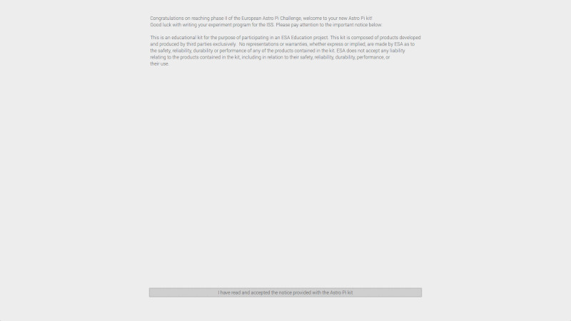
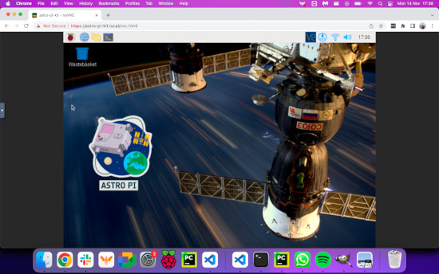
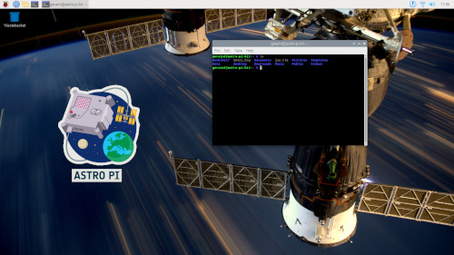

## The Kit OS

### Setting up your OS

When you power on your Astro Pi for the first time you will be invited to accept the ESA License Agreement, as shown below:

{: style="max-width: 80%" }

Once you have accepted the licence agreement, you will be asked to create a new username and password, to set the system time and language settings, and to connect to a WiFi network. For more help on setting up your Raspberry Pi, take a look at [this guide](https://projects.raspberrypi.org/en/projects/raspberry-pi-getting-started/4).


After you have completed these steps, the Astro Pi will reboot itself and you will be ready to start using the Kit OS! 🚀

--- collapse ---
---
title: Optional setup - Accessing the Desktop Flight OS remotely
---

<p style="border-left: solid; border-width:10px; border-color: #fa1111; background-color: #f56c6c; padding: 10px;">
**Note:** Enabling VNC may expose your Raspberry Pi to security threats and could allow a hacker to access your machine. Make sure you understand the risks before enabling it.
</p>

The Kit OS can be configured so that you are able to connect to it from another desktop. To do this, you will need to install a [compatible VNC client](https://www.realvnc.com/en/connect/download/viewer/) on the other desktop, and then enable VNC on the Astro Pi itself by entering the commands below or via the graphical Raspberry Pi Configuration tool (_Menu > Preferences > Raspberry Pi Configuration > Interfaces_).


The default password to connect via VNC is `raspberry` but you are *highly encouraged* to change this using `vncpasswd -service` before enabling VNC.

```bash
sudo raspi-config nonint do_vnc 0
sudo systemctl enable novnc
sudo systemctl start novnc
sudo systemctl unmask avahi-daemon
sudo systemctl enable avahi-daemon
sudo systemctl start avahi-daemon
```

You can also connect to the Desktop Flight OS using just a browser, albeit less-securely. On a machine that is connected to the same network as your Astro Pi kit, open up a browser and type `https://astro-pi-kit.local/vnc.html` in the address bar. 
You will have to tell your browser to trust your unique Astro Pi SSL certificate to continue (e.g. on Chrome, type `thisisunsafe` while the browser tab has focus), but once you have done so you will be lead to the noVNC connection page. Click on the `Connect` button, enter the password you set in `vncpasswd`, and you should see the Flight OS desktop in your browser!



--- /collapse ---


<p style="border-left: solid; border-width:10px; border-color: #fa1111; background-color: #f56c6c; padding: 10px;">
**Note**: Be careful about installing new software on your Kit OS, as it will make it more likely your experiment won't run successfully on the Astro Pis aboard the ISS.

But, if you have accidentally installed anything, you can always redownload and reinstall the Kit OS and start again

</p>

--- collapse ---
---
title: Optional - Downloading a fresh version of the Kit OS
---

If you want to create additional SD cards to use for Astro Pi, or if you accidentally installed something, you can download the [Desktop Flight OS image file](https://downloads.raspberrypi.org/AstroPi_latest) used in the ESA kits. After downloading, you can use any software tool to write the image file to your own SD card. See [this guide](https://www.raspberrypi.org/documentation/installation/installing-images/) for instructions on how to do this.

--- /collapse ---

Now it's time to take a tour of the OS!

### A tour of the OS

The Kit OS is a special version of the Raspberry Pi Desktop OS (Bullseye 32 bit) that contains the same programs and libraries as the Astro Pis aboard the International Space Station.  It includes everything you need to **develop** and **test** your experiment, and more!
Making sure that your program runs successfully in this environment is the best way to ensure that your experiment can run on the Astro Pis on the ISS.

### Applications

There are a lot of applications that are installed in the Kit OS - take a moment to explore the start menu in the top-left corner. Can you find the following applications?


--- collapse ---
---
title: Thonny
---
Thonny is a Python IDE ([Integrated Development Environment](https://simple.wikipedia.org/wiki/Integrated_development_environment)), and is easy to use to get started writing your experiment program.


--- /collapse ---

--- collapse ---
---
title: Visual Studio Code
---
Visual Studio Code is a [text editor](https://simple.wikipedia.org/wiki/Text_editor) and can be used to write programs in many programming languages, including Python. It isn't quite as beginner-friendly as Thonny, but you could also use this to write your program.

--- /collapse ---

--- collapse ---
---
title: File Manager
---
The File Manager is used to ... manage files! Every file on your computer can be accessed using this application. For more information, check out [this page](https://projects.raspberrypi.org/en/projects/raspberry-pi-using/7)

--- /collapse ---

--- collapse ---
---
title: Chromium
---
Chromium is the default web-browser on Raspberry Pi OS - use it to get help preparing your experiment!

--- /collapse ---

--- collapse ---
---
title: Terminal
---
Terminal is an application that you can use to run other programs and automate almost any task on your computer. As an example to get started, type `python3` to open up a python interpreter. Check out [this page](https://projects.raspberrypi.org/en/projects/raspberry-pi-using/8) for more information about the Terminal.


--- /collapse ---

### Python & Python Libraries

--- collapse ---
---
title: What is Python?
---
Python is the general purpose programming language that you will use to run your experiment! Python programs are instructions formed of special words telling the computer what to do. Using Python you can do almost anything you can imagine! The application that runs a Python program is called the _interpreter_. If this is your first time with Python, check out [this project](https://projects.raspberrypi.org/en/codeclub/python-module-1).
--- /collapse ---

The Kit OS comes with Python version 3.9.2 and many additional Python _libraries_ pre-installed to help you write the program for your experiment. The same Python and library versions have been installed on the Astro Pis aboard the ISS, so running your program on the Kit OS should behave similar as it would in space! 

<p style="border-left: solid; border-width:10px; border-color: #d17500; #ff8f00; background-color: #ff8f00; padding: 10px;">
Because the ISS is a secured environment, these are the only libraries that you will be allowed to use in your experiment if it runs on the Astro Pis on board. Please [contact us](mailto:enquiries@astro-pi.org) if you think anything is missing or have any suggestions!
</p>

### Python libraries

--- collapse ---
---
title: What is a Python library?
---
A 'library' or 'package' is a collection of program 'blocks' that solve a specific problem or achieve a specific goal. You use them by 'importing' them into your Python program: `import numpy as np`, for example. Using libraries avoids having to solve the same problem twice, and makes the process of programming easier.

--- /collapse ---

Take some time now to familiarise yourself with the libraries available to use on the Astro Pis, which are listed below. Each library is briefly described and is presented with an example of how to use it, together with links to external documentation where you can learn more. Don't worry if this is a lot of information - bookmark this page for later!

--- collapse ---
---
title: skyfield
---

#### Usage

Skyfield is an astronomy package that computes the positions of stars, planets, and satellites in orbit around the Earth.

In the [How to find the location of the ISS](6) section you can find out how to use skyfield to obtain the position of the International Space Station above the Earth and how to determine whether the ISS is sunlit.

#### Documentation

- [rhodesmill.org/skyfield](https://rhodesmill.org/skyfield/)

--- /collapse ---

--- collapse ---
---
title: picamera
---

The Python library for controlling the Raspberry Pi Camera Module is `picamera`. To get started, check out [this project](https://projects.raspberrypi.org/en/projects/getting-started-with-picamera/4) for a handy walkthrough of how to use it.

#### Usage

```python
from picamera import PiCamera
from time import sleep

camera = PiCamera()
camera.resolution = (2592, 1944)

for i in range(3*60):
    camera.capture(f'image_{i:03d}.jpg')  # Take a picture every minute for 3 hours
    sleep(60)
```

#### Documentation

- [picamera.readthedocs.io](https://picamera.readthedocs.io)

--- /collapse ---

--- collapse ---
---
title: colorzero
---

`colorzero` is a colour manipulation library that aims to be simple to use.

#### Usage

`colorzero` makes it easy to transition between two colours:

```python
from colorzero import Color
from sense_hat import SenseHat
from time import sleep

sense = SenseHat()

start = Color('yellow')
end = Color('cyan')

# Slowly transition the Sense HAT from the `start` to the `end` colour
for color in start.gradient(end, steps=100):
    sense.clear(color.rgb_bytes)
    sleep(0.1)
```

#### Documentation

- [colorzero.readthedocs.io](https://colorzero.readthedocs.io)

--- /collapse ---

--- collapse ---
---
title: gpiozero
---

GPIO Zero is a simple but powerful GPIO (General Purpose Input Output) library. Most of its its functionality is restricted aboard the ISS - for example, the only pin you are allowed to access is GPIO pin 12, where the motion sensor is connected. However, some of its other features can be handy in your experiment, such as the internal device `CPUTemperature`.

#### Usage

Compare the Raspberry Pi's CPU temperature to the Sense HAT's temperature reading:

```python
from sense_hat import SenseHat
from gpiozero import CPUTemperature

sense = SenseHat()
cpu = CPUTemperature()

while True:
    print(f'CPU: {cpu.temperature}')
    print(f'Sense HAT: {sense.temperature}')
```

#### Documentation

- [gpiozero.readthedocs.io](https://gpiozero.readthedocs.io)

--- /collapse ---

--- collapse ---
---
title: GDAL
---

The Geospatial Data Abstraction Library (GDAL) is an open-source, cross-platform set of libraries and low-level tools for working with geospatial data in many formats. For most purposes on Astro Pi you may want to look at using `earthpy` or `geopandas` instead which are simpler to use.

#### Documentation

- [GDAL Cookbook](http://pcjericks.github.io/py-gdalogr-cookbook/index.html)
- [pypi.org/project/GDAL](https://pypi.org/project/GDAL/)

--- /collapse ---

--- collapse ---
---
title: geopandas
---

GeoPandas is a package to make working with geospatial data in python easier. GeoPandas extends the datatypes used by the `pandas` package to allow spatial operations on geometric types. The [examples gallery](https://geopandas.org/en/stable/gallery/index.html#) shows how  to create a variety of graphs using geospatial data.

#### Usage

Start exploring a dataset interactively:
```python
import geopandas

path_to_data = geopandas.datasets.get_path("nybb")
gdf = geopandas.read_file(path_to_data)
gdf = gdf.set_index("BoroName")
gdf["area"] = gdf.area
gdf.explore("area", legend=False)
```

#### Documentation
- [https://geopandas.org/en/stable/docs.html](https://geopandas.org/en/stable/docs.html)

--- /collapse ---

--- collapse ---
---
title: earthpy
---

EarthPy is a package that makes it easier to plot and work with spatial raster and vector data . 
The [examples gallery](https://earthpy.readthedocs.io/en/latest/gallery_vignettes/index.html) includes examples on how to plot bands of satellite imagery and how to calculate NDVI.

#### Usage

```python
import earthpy.plot as ep
import numpy as np

arr = np.random.randint(4, size=(3, 5, 5))
ep.plot_bands(arr)
```

#### Documentation

- [https://earthpy.readthedocs.io/en/latest/index.html](https://earthpy.readthedocs.io/en/latest/index.html)

--- /collapse ---

--- collapse ---
---
title: numpy
---

`numpy` is a general-purpose array-processing library designed to efficiently manipulate large multidimensional arrays (e.g. matrixes) of arbitrary records without sacrificing too much speed for small multidimensional arrays.

#### Usage

`numpy` is particularly handy for capturing camera data for manipulation:

```python
from picamera import PiCamera
from time import sleep
import numpy as np

camera = PiCamera()

camera.resolution = (320, 240)
camera.framerate = 24
output = np.empty((240, 320, 3), dtype=np.uint8)
sleep(2)
camera.capture(output, 'rgb')
```

#### Documentation

- [docs.scipy.org/doc](https://docs.scipy.org/doc/)

--- /collapse ---

--- collapse ---
---
title: SciPy
---

SciPy is a free and open-source Python library used for scientific computing and technical computing. SciPy contains modules for optimisation, linear algebra, integration, interpolation, special functions, FFT (Fast Fourrier Transform), signal and image processing, ODE (Ordinary Differential Equations) solvers, and other tasks common in science and engineering. You may need to use this library to solve a particular equation, for example.

#### Documentation

- [docs.scipy.org/doc](https://docs.scipy.org/doc/)

--- /collapse ---

--- collapse ---
---
title: TensorFlow Lite and PyCoral
---

TensorFlow Lite and the PyCoral library can be used to use or re-train existing machine-learning models for inference. The latter is built on top of TensorFlow Lite but has a simpler, higher-level interface and allows you to easily use the Coral USB Accelerator (Edge TPU). Note that Tensorflow (as opposed to TensorFlow Lite) is not supported by the Kit OS because Tensorflow requires a 64 bit operating system. You may want to use these libraries to create object classifiers, for example. For more information, see the [Machine Learning and computer vision](7) section.

#### Documentation

- [Tensorflow Lite](https://www.tensorflow.org/lite/api_docs/python/tf/lite)
- [PyCoral](https://coral.ai/docs/edgetpu/tflite-python/)
--- /collapse ---

--- collapse ---
---
title: pandas
---

`pandas` is an open-source library providing high-performance, easy-to-use data structures and data analysis tools. You may want to use it when you are analysing the results of your program test runs.

#### Usage

```python
import pandas as pd

df = pd.read_csv("my_test_data.csv")
df.describe()
```

#### Documentation

- [pandas.pydata.org](https://pandas.pydata.org/)

--- /collapse ---

--- collapse ---
---
title: logzero
---

`logzero` is a library used to make logging easier. Logs are records of what happened while a program was running, and can be really useful for debugging.

#### Usage

Logs are categorised into different levels according to severity. By using the various levels appropriately you will be able to tune the amount of information you get about your program according to your debugging needs.

```python
from logzero import logger

logger.debug("hello")
logger.info("info")
logger.warning("warning")
logger.error("error")
```

#### Documentation

- [logzero.readthedocs.io](https://logzero.readthedocs.io/en/latest/)

--- /collapse ---

--- collapse ---
---
title: matplotlib
---

`matplotlib` is a 2D plotting library that produces publication-quality figures in a variety of hard copy formats and interactive environments. You may want to use it to analyse the results of your test runs.

#### Usage

```python
from sense_hat import SenseHat
from gpiozero import CPUTemperature
import matplotlib.pyplot as plt
from time import sleep

sense = SenseHat()
cpu = CPUTemperature()

st, ct = [], []
for i in range(100):
    st.append(sense.temperature)
    ct.append(cpu.temperature)
    sleep(1)

plt.plot(st)
plt.plot(ct)
plt.legend(['Sense HAT temperature sensor', 'Raspberry Pi CPU temperature'], loc='upper left')
plt.show()
```


#### Documentation

- [matplotlib.org](https://matplotlib.org/)

--- /collapse ---

--- collapse ---
---
title: Pillow
---

Pillow is an image processing library. It provides extensive file format support, an efficient internal representation, and fairly powerful image processing capabilities.

The core image library is designed for fast access to data stored in a few basic pixel formats. It should provide a solid foundation for a general image processing tool.

#### Documentation

- [pillow.readthedocs.io](https://pillow.readthedocs.io/)

--- /collapse ---

--- collapse ---
---
title: opencv
---

`opencv` is an open-source computer vision library. The Astro Pi units specifically have the `opencv-contrib-python-headless` package installed, which includes all of `opencv` plus additional modules (listed in the [opencv docs](https://docs.opencv.org/master/)), and excludes all GUI functionality. You may want to use opencv for [edge detection](https://projects.raspberrypi.org/en/projects/astropi-iss-speed/3), for example.

#### Documentation

- [docs.opencv.org](https://docs.opencv.org/4.4.0/)

--- /collapse ---

--- collapse ---
---
title: exif
---

`exif` allows you to read and modify image EXIF metadata using Python. You may want to use it to embed GPS data into any images you take, or to [analyse photos taken aboard the ISS](https://projects.raspberrypi.org/en/projects/astropi-iss-speed/1).

#### Documentation

- [pypi.org/project/exif](https://pypi.org/project/exif/)

--- /collapse ---

--- collapse ---
---
title: scikit-learn
---

`scikit-learn` is a set of simple and efficient tools for data mining and data analysis that are accessible to everybody, and reusable in various contexts. It's designed to interoperate with `numpy`, `scipy`, and `matplotlib`.

#### Documentation

- [scikit-learn.org](https://scikit-learn.org)

--- /collapse ---

--- collapse ---
---
title: scikit-image
---

`scikit-image` is an open-source image processing library. It includes algorithms for segmentation, geometric transformations, colour space manipulation, analysis, filtering, morphology, feature detection, and more.

#### Documentation

- [scikit-image.org](https://scikit-image.org/)

--- /collapse ---

--- collapse ---
---
title: reverse-geocoder
---

`reverse-geocoder` takes a latitude/longitude coordinate and returns the nearest town/city.

#### Usage

When used with `skyfield`, `reverse-geocoder` can determine where the ISS currently is:

```python
import reverse_geocoder
from orbit import ISS

coordinates = ISS.coordinates()
coordinate_pair = (
    coordinates.latitude.degrees,
    coordinates.longitude.degrees)
location = reverse_geocoder.search(coordinate_pair)
print(location)
```
This output shows the ISS is currently over Hamilton, New York:

```
[OrderedDict([
    ('lat', '42.82701'), 
    ('lon', '-75.54462'), 
    ('name', 'Hamilton'), 
    ('admin1', 'New York'), 
    ('admin2', 'Madison County'), 
    ('cc', 'US')
])]
```

#### Documentation

- [github.com/thampiman/reverse-geocoder](https://github.com/thampiman/reverse-geocoder)

--- /collapse ---

--- collapse ---
---
title: sense_hat
---
The `sense_hat` library is the main library used to collect data using the Astro Pi Sense HAT. Look at [this project](https://projects.raspberrypi.org/en/projects/getting-started-with-the-sense-hat) to get started. 

#### Usage

You can log the humidity to the display using the code below:

```python
from sense_hat import SenseHat
sense = SenseHat()
sense.show_message(sense.get_humidity())
```

#### Documentation

- [https://pythonhosted.org/sense-hat/](https://pythonhosted.org/sense-hat/)
- [Additional documentation for the colour sensor](https://gist.github.com/boukeas/e46ab3558b33d2f554192a9b4265b85f)

--- /collapse ---

--- collapse ---
---
title: pisense
---

`pisense` is an alternative interface to the Raspberry Pi Sense HAT. The major difference to `sense_hat` is that in `pisense` the various components of the Sense HAT (the screen, the joystick, the environment sensors, etc.) are each represented by separate classes that can be used individually or by the main class that comprises them all.

The screen has a few more tricks including support for any fonts that PIL supports, representation as a numpy array (which makes scrolling by assigning slices of a larger image very simple), and several rudimentary animation functions. The joystick, and all sensors, have an iterable interface too.

#### Usage

```python
from pisense import SenseHAT, array
from colorzero import Color

hat = SenseHAT(emulate=True)
hat.screen.clear()

B = Color('black')
r = Color('red')
w = Color('white')
b = Color('blue')

black_line = [B, B, B, B, B, B, B, B]
flag_line = [B, b, b, w, w, r, r, B]
flag = array(black_line * 2 + flag_line * 4 + black_line * 2)

hat.screen.fade_to(flag)
```

#### Documentation

- [pisense.readthedocs.io](https://pisense.readthedocs.io/en/latest/)

--- /collapse ---

## Next steps

This concludes our brief tour of the Kit OS! As you've seen, there are a lot of applications and libraries to become familiar with. With a good plan of action you will be soon using them in your own experiment. In the next step, you will learn about how to plan phase 2 of your experiment.

