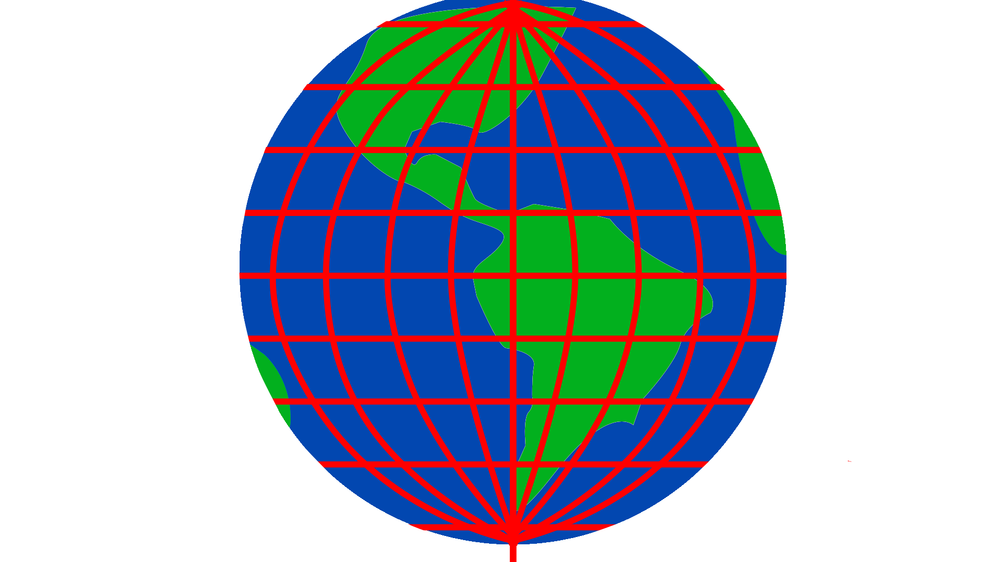

## Finding the location of the ISS

For many experiments it's really useful to be able to calculate the location of the ISS. Knowing this can help you work out where in the world the ISS is flying over, or to determine if the Earth and ISS is sunlit, or even allow you to alter your program logic to react to this information!

### The orbit library

The easiest way to find the location of the ISS is to use the `orbit` Python library. You can import this library and use the `coordinates` function to work out where on Earth the ISS is flying over:

```python
from orbit import ISS
location = ISS.coordinates()
print(location)
```

---collapse---
---
title: How does it work?
---
The `orbit` library internally uses the [skyfield](https://rhodesmill.org/skyfield/) library.  Skyfield is a Python library that allows you to calculate the positions of space objects within our solar system. For accurate calculations, `skyfield` requires the most recent two-line element (TLE) set for the ISS. TLE is a data format used to convey sets of orbital elements that describe the orbits of Earth satellites, and looks something look something like this:

```
ISS (ZARYA)             
1 25544U 98067A   21162.24455464  .00001369  00000-0  33046-4 0  9995
2 25544  51.6454  12.1174 0003601  83.6963  83.5732 15.48975526287678
```

When you import the `ISS` object from the `orbit` library, an attempt is made to retrieve the TLE data from a file called `iss.tle` in the home folder. If the file is not present but an internet connection is available, the latest data will be downloaded automatically into the `iss.tle` file, so you don't need to worry about it. However, if your Astro Pi kit has no internet access, then you need to manually download the latest [ISS TLE data](http://www.celestrak.com/NORAD/elements/stations.txt), copy the three ISS-related lines into a file called `iss.tle`, and then place this file into your home folder. 

The `ISS` object is implemented as a skyfield `EarthSatellite` object 
(see the [reference](https://rhodesmill.org/skyfield/api-satellites.html#skyfield.sgp4lib.EarthSatellite) and [examples](https://rhodesmill.org/skyfield/earth-satellites.html)). For example, this is how to compute the coordinates of the Earth location that is currently directly beneath the ISS:

```python
from orbit import ISS
from skyfield.api import load

# Obtain the current time `t`
t = load.timescale().now()
# Compute where the ISS is at time `t`
position = ISS.at(t)
# Compute the coordinates of the Earth location directly beneath the ISS
location = position.subpoint()
print(location)
```

<div style="border-left: solid; border-width:10px; border-color: #0faeb0; background-color: aliceblue; padding: 10px;">
**Note**: The current position of the ISS is an **estimate**, based on the telemetry data and the current time. Therefore, when you are testing your program on Desktop Flight OS, you need to make sure that the system time has been set correctly.
</div>

--- /collapse ---

If you need to, you can access the individual elements of the location, using the [`GeographicPosition` API](https://rhodesmill.org/skyfield/api-topos.html#skyfield.toposlib.GeographicPosition).

```python
print(f'Latitude: {location.latitude}')
print(f'Longitude: {location.longitude}')
print(f'Elevation: {location.elevation.km}')
```
Note that the latitude and longitude are `Angle`s and the elevation is a `Distance`. The documentation describes [how to switch between different Angle representations](https://rhodesmill.org/skyfield/api-units.html#skyfield.units.Angle) or [how to express Distance in different units](https://rhodesmill.org/skyfield/api-units.html#skyfield.units.Distance): 

--- collapse ---
---
title: What are latitude and longitude?
---

Latitude and longitude are a system of lines used to describe the location of anywhere on Earth. Latitude measures the distance north or south of the equator, while longitude measures the distance west or east of the equator. In the diagram below, latitude lines are horizontal and longitude lines are vertical.



There are a couple of different ways of expressing latitude and longitude which are useful to be aware of:

#### Decimal Degrees format 
```python
print(f'Lat: {location.latitude.degrees:.1f}, Long: {location.longitude.degrees:.1f}')
```

The code above outputs latitude and longitude values in the Decimal Degrees (DD) format, where coordinates are written using degrees (°) as the unit of measurement. There are 180° of latitude: 90° north and 90° south of the equator. There are 360° of longitude: 180° east and 180° west of the prime meridian (the zero point of longitude, defined as a point in Greenwich, England). To precisely specify a location, each degree can be reported as a decimal number, e.g. (-28.277777, 71.5841666). 

#### Degrees minutes seconds

```python
print(f'Lat: {location.latitude.signed_dms()}, Long: {location.longitude.signed_dms()}')
```
Another approach is the degrees:minutes:seconds (DMS) format, where each degree is split into 60 minutes (’) and each minute is divided into 60 seconds (”). For even finer accuracy, fractions of seconds given by a decimal point are used. The **sign** of the angle indicates whether the point that the coordinate refers to is north or south of the equator (for latitude) and east or west of the meridian (for longitude).

---/collapse---

### Capturing location data

It is very useful to record the position of the Space Station for any images that you capture. You can do this by attaching **metadata** to the image file itself using the `exif` library.

In the snippet below, a function called `capture` is called to capture an image, after setting the EXIF data to the current latitude and longitude. The coordinates in the EXIF data of images are stored using a variant of the degrees:minutes:seconds (DMS) format, and you can see how the `convert` function takes the data returned `ISS.coordinates()` and converts it into a format suitable for storing as EXIF data. Using functions to perform these tasks keeps the program tidy.

```python
from orbit import ISS
from picamera import PiCamera
from pathlib import Path

def convert(angle):
    """
    Convert a `skyfield` Angle to an EXIF-appropriate 
    representation (positive rationals)
    e.g. 98° 34' 58.7 to "98/1,34/1,587/10"

    Return a tuple containing a boolean and the converted angle,
    with the boolean indicating if the angle is negative.
    """
    sign, degrees, minutes, seconds = angle.signed_dms()
    exif_angle = f'{degrees:.0f}/1,{minutes:.0f}/1,{seconds*10:.0f}/10'
    return sign < 0, exif_angle

def capture(camera, image):
    """Use `camera` to capture an `image` file with lat/long EXIF data."""
    point = ISS.coordinates()

    # Convert the latitude and longitude to EXIF-appropriate representations
    south, exif_latitude = convert(point.latitude)
    west, exif_longitude = convert(point.longitude)
    
    # Set the EXIF tags specifying the current location
    camera.exif_tags['GPS.GPSLatitude'] = exif_latitude
    camera.exif_tags['GPS.GPSLatitudeRef'] = "S" if south else "N"
    camera.exif_tags['GPS.GPSLongitude'] = exif_longitude
    camera.exif_tags['GPS.GPSLongitudeRef'] = "W" if west else "E"

    # Capture the image
    camera.capture(image)

cam = PiCamera()
cam.resolution = (1296,972)

base_folder = Path(__file__).parent.resolve()
capture(cam, f"{base_folder}/gps1.jpg")
```

--- collapse ---
---
title: Finding the location of an image
---


When coordinate information is included in the EXIF metadata of your captured images, you can use software such as [DigiKam](https://www.digikam.org/about/) (included in the Desktop Flight OS) or an online service to automatically locate the position where the image was taken on a map. Alternatively, you can extract the coordinates from the image using the `exif` library.

--- /collapse ---

### Example: ISS in the sunlight

The behaviour of your code might differ depending on whether or not the ISS is in sunlight.
The `skyfield` library includes an `is_sunlit` method (documentation [here](https://rhodesmill.org/skyfield/earth-satellites.html#find-when-a-satellite-is-in-sunlight)) which you can use with an "ephemeris" table to calculate whether the ISS is sunlit at a specific time:

```python
from orbit import ISS, ephemeris
from skyfield.api import load

timescale = load.timescale()
t = timescale.now()
if ISS.at(t).is_sunlit(ephemeris):
    print("In sunlight")
else:
    print("In darkness")
```

--- collapse ---
---
title: What is an ephemeris?
---
An ephemeris is a high accuracy table of the position of celestial objects. In this case, it is needed to compute the positions of the Earth and the Sun at a specific point in time. 

The `orbit` library makes it easy to import an ephemeris - all you have to do is put `from orbit import ephemeris` and use pass the `ephemeris` object to `is_sunlit`. In the background, `orbit` will download an ephemeris (`de421.bsp`) to your home folder. If you don't have internet access on your Raspberry Pi you will need to do this yourself by saving [this file](https://naif.jpl.nasa.gov/pub/naif/generic_kernels/spk/planets/a_old_versions/de421.bsp) on another computer and put it in your home folder manually. Fortunately these files never change so you only need to do this once!
---/collapse ---


<p style="border-left: solid; border-width:10px; border-color: #0faeb0; background-color: aliceblue; padding: 10px;">
The `is_sunlit` method is a good approximation but it is not 100% reliable: remember that because of the altitude of the ISS the sun rises on the ISS slightly earlier than it does on the surface of the Earth below the ISS. Similarly, the sun sets on the ISS slightly later than it does on the surface of the Earth directly below it. 
</p>

